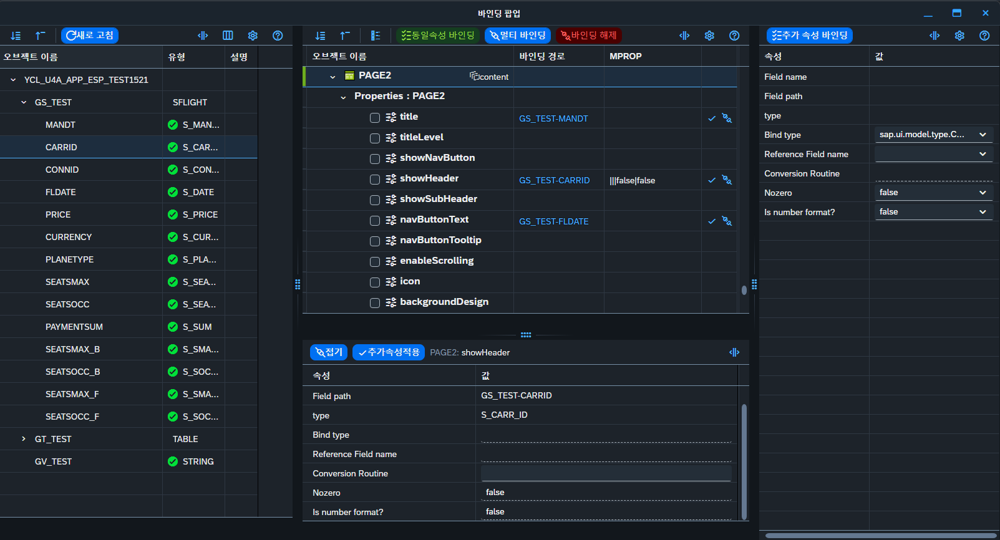
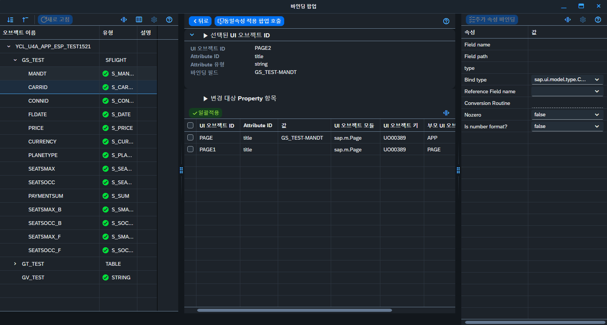
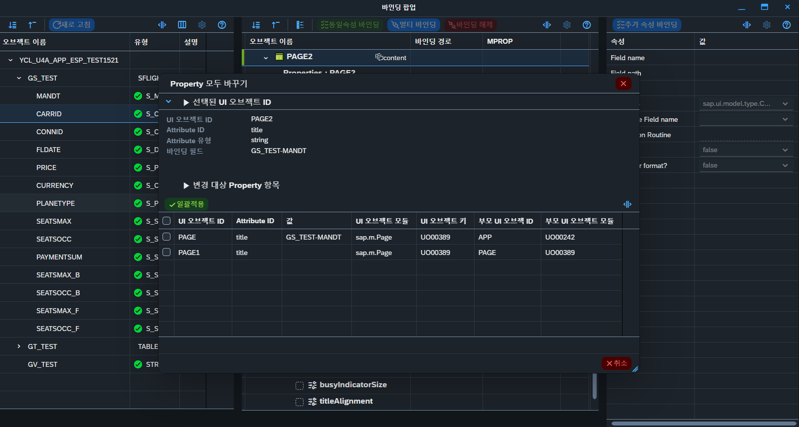
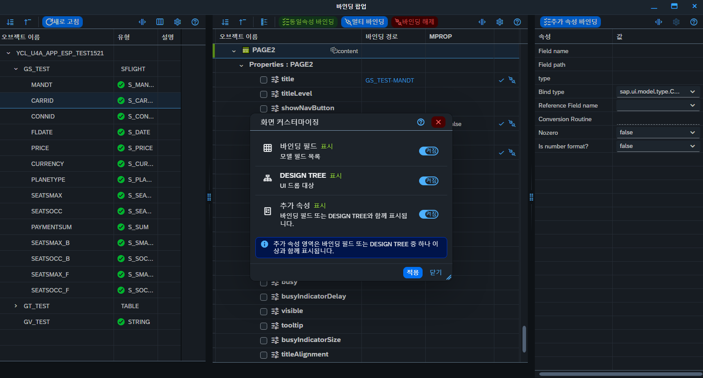

# 바인딩 팝업 (Binding Popup) 기능 명세서

> 이 문서는 AI가 아래 3가지 목적으로 사용하기 위해 작성되었다.
> 1. **UI5 → 순수 HTML 전환**: 이 화면(또는 유사 화면)을 SAPUI5 없이 재구현할 때 정확히 동일한 데이터 구조·상태·동작을 재현하기 위한 근거 문서.
> 2. **영향도 판단**: 새로운 기능 추가/수정이 바인딩 팝업의 기존 동작(바인딩 가능/불가 판정, 멀티 바인딩, 동일속성 바인딩, 추가속성 등)을 깨뜨리는지 판단하기 위한 기준.
> 3. **유지보수**: 함수명, 모델 프로퍼티명, 메시지 코드, 매직 코드(UIATK 등)를 실제 코드와 대조해 빠르게 원인을 추적하기 위한 색인.
>
> 소스 루트: `C:\WORK\U4A_WS3.0\U4A_WS3.0.0-main\www\ws30\ws10_20\Popups\bindPopup\`
> 이 팝업은 **Electron BrowserWindow**로 뜨는 독립 SAPUI5 앱이며(`index.html`이 frameless 커스텀 타이틀바를 그림), 부모 창(WS20 디자인 화면)과는 `BroadcastChannel` + Electron IPC로 통신한다. 화면 캡처 4장(`img/image01~04.png`, 이 문서와 같은 폴더)의 UI와 아래 서술이 1:1 대응한다.

### 화면 캡처 목록

| 이미지 | 화면 | 관련 섹션 |
|---|---|---|
| `img/image01.png` | 기본 화면 — 좌(바인딩 필드)/중(DESIGN TREE)/우(바인딩 추가 속성) 3분할, 하단에 바인딩 경로 클릭으로 열린 추가속성 상세 패널 | [§1.3](#13-3분할-레이아웃), [§3.5](#35-바인딩-경로-컬럼-링크-클릭--하단-스플리터-표시) |
| `img/image02.png` | 동일속성 바인딩(Synchronizing Bind) 화면 — 상단 "선택된 UI 오브젝트 ID", 하단 "변경 대상 Property 항목" 리스트 | [§5](#5-동일속성-바인딩synchronizing-bind-화면) |
| `img/image03.png` | "Property 모두 바꾸기" — 동일속성 적용 팝업 호출 시 뜨는 비모달 플로팅 다이얼로그 | [§5.5](#55-동일속성-적용-팝업-호출--비모달-플로팅-다이얼로그) |
| `img/image04.png` | 화면 커스터마이징 팝업 — 바인딩 필드/DESIGN TREE/추가 속성 표시·숨김 스위치 | [§7](#7-화면-커스터마이징패널-표시숨김) |

---

## 목차

1. [전체 구조 개요](#1-전체-구조-개요)
2. [왼쪽 영역 — 바인딩 필드(모델 필드 트리)](#2-왼쪽-영역--바인딩-필드모델-필드-트리)
3. [가운데 영역 — DESIGN TREE](#3-가운데-영역--design-tree)
4. [오른쪽 영역 — 바인딩 추가 속성](#4-오른쪽-영역--바인딩-추가-속성)
5. [동일속성 바인딩(Synchronizing Bind) 화면](#5-동일속성-바인딩synchronizing-bind-화면)
6. [멀티 바인딩 / 바인딩 해제 / 추가속성 일괄적용 — 검증 규칙](#6-멀티-바인딩--바인딩-해제--추가속성-일괄적용--검증-규칙)
7. [화면 커스터마이징(패널 표시/숨김)](#7-화면-커스터마이징패널-표시숨김)
8. [부모창(WS20 디자인 화면)과의 동기화 아키텍처](#8-부모창ws20-디자인-화면과의-동기화-아키텍처)
9. [핵심 상수 / 코드 값 총정리](#9-핵심-상수--코드-값-총정리)
10. [메시지 코드 (ZMSG_WS_COMMON_001)](#10-메시지-코드-zmsg_ws_common_001)
11. [알려진 데드 코드 / 레거시 / 주의사항](#11-알려진-데드-코드--레거시--주의사항)
12. [AI 활용 가이드](#12-ai-활용-가이드)

---

## 1. 전체 구조 개요

### 1.1 실행 환경

- `index.html` + `index.js`가 Electron frameless `BrowserWindow`로 열린다 (`ws30/ws10_20/js/fnDialogPopupOpener.js`의 `oAPP.fn.fnBindWindowPopupOpener()`가 opener).
- `index.js`는 두 단계 IIFE로 구성:
  - **바깥 IIFE**: 커스텀 타이틀바(최소화/최대화/닫기), DPI 스케일 대응 드래그, 테마 적용 등 Electron 프레임 로직. Electron IPC 이벤트 `if_modelBindingPopup`로 부모 창에서 초기 데이터(`T_0014`, `T_0015`, `T_9011`, `T_0022`, `T_0023`, `T_CEVT`, `channelKey`, `SSID` 등)를 1회 수신한다.
  - **안쪽 IIFE (`initBindPopupContent`)**: 실제 바인딩 앱. `oAPP.fn.callBindPopup()`이 SAPUI5 3분할 레이아웃을 만들고, 가운데/오른쪽 영역은 별도 모듈(`uiModule/designTree.js`, `uiModule/bindAdditInfo.js`)을 동적 로드해서 위임한다.
- HTML로 포팅 시: 이 문서에서 "Electron/타이틀바/DPI 드래그" 관련 서술은 포팅 대상이 아니다(순수 화면 골격 + 창 컨트롤만 재현하면 됨). **바인딩 업무 로직(트리 구조, 바인딩 가능판정, 드래그앤드롭 매핑, 추가속성, 동일속성, 멀티바인딩)은 전부 포팅 대상.**

### 1.2 오브젝트 네임스페이스

전역 `oAPP` 객체 하위에:

| 네임스페이스 | 내용 |
|---|---|
| `oAPP.attr` | 전역 상태 — `T_0014`(UI 오브젝트 목록), `T_0015`(바인딩 정보), `T_0022`/`T_0023`(속성 메타데이터), `T_9011`(공통코드), `T_CEVT`(클라이언트 이벤트), `prev`(OBJID별 UI 프리뷰 캐시), `oModel`(왼쪽 모델필드 JSONModel), `oDesign`(가운데 DESIGN TREE 모듈 인스턴스), `oAddit`(오른쪽 추가속성 모듈 인스턴스), `oBindLayoutState`, `DnDRandKey`, `channelKey`, `bSyncEqualityScreenActive` |
| `oAPP.ui` | 팝업 자체가 만든 최상위 SAPUI5 컨트롤(`oModelFieldTree`, `oSptMain`, `oPageLeft/Center/Right`, `oAdditTab` 등) |
| `oAPP.fn` | 공용 함수 저장소. 바인딩 실제 쓰기 함수(`attrSetBindProp`, `attrBindCallBackAggr`, `attrSetUnbindProp`, `attrUnbindAggr`, `attrUnbindTree`), 레이아웃 함수(`setAdditLayout`, `applyBindLayoutCustomizing`), 검증 함수(`chkAdditBindData`, `setAdditBindData`) 등 |
| `oAPP.oMain` | `broadToChild`(자식 팝업들과의 BroadcastChannel), `attr.isBusy`, `fn.resizeSplitter` |
| `oAPP.types` | ABAP 구조체 스타일의 템플릿 객체(`TY_BIND_ERROR`, `TY_ADDIT_MSG`, `TY_BUSY_OPTION`) |

`oAPP.attr.oDesign`/`oAPP.attr.oAddit`는 각각 `uiModule/designTree.js`, `uiModule/bindAdditInfo.js`의 `start()`가 반환한 컨트롤러 객체(`{ui, fn, oModel, attr, types}`)이다.

### 1.3 3분할 레이아웃



```
sap.m.App
 └─ sap.m.Page (showHeader:false)
     └─ sap.ui.layout.Splitter (oSptMain)               ← 메인 3분할
         ├─ [좌] sap.m.Page (oPageLeft)     visible:"{/BIND_LAYOUT/MODEL}"
         │     └─ sap.ui.table.TreeTable (oModelFieldTree)   ← "바인딩 필드"
         ├─ [중] sap.m.Page (oPageCenter)   visible:"{/BIND_LAYOUT/DESIGN}"
         │     └─ sap.ui.layout.Splitter (세로, oSptCenter)
         │          ├─ area1: DESIGN TREE 모듈 마운트 지점
         │          └─ (BULK 모드) oPageAdit — DESIGN TREE 하단 "바인딩 추가속성" 도킹 패널
         └─ [우] sap.m.Page (oPageRight)    visible:"{/BIND_LAYOUT/ADDIT}"
               └─ 추가속성 모듈 마운트 지점 (oAdditTab)
```

패널 표시/숨김을 제어하는 모델 프로퍼티(전부 `oAPP.attr.oModel` 루트에 존재):

| 프로퍼티 | 의미 |
|---|---|
| `BIND_LAYOUT = {MODEL, DESIGN, ADDIT}` | 각 패널 표시 여부(불리언). `oAPP.attr.oBindLayoutState`와 동기화, `localStorage` 키 `U4A_BIND_POPUP_LAYOUT_${browserkey|SSID}`에 저장 |
| `width` / `width_c` / `width_r` | 좌/중/우 패널 `SplitterLayoutData.size` |
| `height` | 가운데 세로분할(트리 vs 하단 추가속성) 크기 |
| `resize` / `resize_v` | 좌 패널, 가운데 세로분할 리사이즈 가능 여부 |
| `vis_addit` | DESIGN TREE 하단 추가속성 패널 표시 여부(=필드행 선택 중일 때만) |
| `edit` / `edit_refresh` / `edit_layout_customizing` | 전역 편집 잠금 3종(동시에 `setViewEditable`로 토글) |
| `busy` | 범용 busy 바인딩 |

**바인딩 모드**: `oAPP.attr.BIND_MODE`는 `CS_BIND_MODE.BULK`("02")가 기본값이며 실제로 사용되는 유일한 모드. `DEFAULT`("01") 모드 코드는 존재하나 사실상 사용되지 않음(레거시) — 포팅 시 BULK 모드 기준으로만 구현하면 된다.

### 1.4 데이터 원천

- **T_0014**: 캔버스에 배치된 UI 컨트롤 인스턴스 목록(부모 WS20 캔버스의 컨트롤 트리를 그대로 미러링).
- **T_0015**: 이미 바인딩된 속성/aggregation 정보(OBJID+UIATK 키로 T_0014 인스턴스에 매핑).
- **T_0022/T_0023**: 컨트롤 클래스별 프로퍼티/aggregation 메타데이터(어떤 속성이 존재하는지, `UIATY` 등).
- **좌측 "바인딩 필드" 트리(`oAPP.attr.oModel.oData.TREE`/`zTREE`)**: 서버 API `POST {servNm}/getBindAttrData`로 조회(컨트롤러 클래스에 선언된 광역 변수 = 인터널 테이블/구조/일반 변수 목록). 이 데이터는 **WS20 캔버스가 아니라 서버(ABAP 컨트롤러 클래스)에서 오는 것**이며, 사용자가 화면에서 설명한 "광역 변수 tree"에 해당한다.

---

## 2. 왼쪽 영역 — 바인딩 필드(모델 필드 트리)

`oAPP.ui.oModelFieldTree` (`sap.ui.table.TreeTable`), 컬럼: **오브젝트 이름**(`NTEXT`, 필터가능) / **유형**(아이콘+`TYPE`) / **설명**(`DESCR`). `rows`는 `/zTREE` 경로에 `arrayNames:["zTREE"]`로 바인딩된 재귀 트리.

### 2.1 바인딩 가능/불가능 판정 — `modelFieldArea/bindPossible.js`

이 파일이 좌측 트리 각 행의 `enable`/아이콘/색상을 계산한다. 매 호출(가운데 DESIGN TREE에서 속성/aggregation 행을 선택할 때마다)마다 다시 계산됨.

**행 종류 `KIND`**:

| KIND | 의미 |
|---|---|
| `T` | 인터널 테이블(Internal Table) |
| `S` | 구조(Structure) — **직접 바인딩 대상이 아님**, 하위 탐색을 위한 투명 컨테이너 |
| `E` | 일반 필드(Elementary field) |

**바인딩 대상(`CARDI`)** — 가운데서 선택한 속성/aggregation의 종류에 따라 `setFieldCardinality()`가 계산:

| CARDI | 의미 | 트리거 조건 |
|---|---|---|
| `F` | 필드만 가능(Property 바인딩) | `UIATY==="1"` (일반 프로퍼티) — 기본값 |
| `T` | 테이블(Aggregation)만 가능 | `UIATY==="3"` (Aggregation) |
| `R` | Range table만 가능 | 선택 속성이 SelectOption2/3의 VALUE (`UIATK` `EXT00001161`/`EXT00002507`) |
| `ST` | String table만 가능 | 선택 속성이 `ISMLB==="X"`(배열형)이고 `UIADT`가 `int`/`float`가 아닐 때 |
| `S` | 구조만 가능 | 코드상 `lf_setBindEnable`의 `"S"` 분기는 있으나 **이 파일 안에서는 생성되지 않음**(외부에서 `_CARDI="S"`를 세팅하는 다른 호출자가 있다는 뜻 — 유지보수 시 확인 필요) |

**핵심 규칙(사용자가 요청한 "바인딩 가능/불가능" 상세)**:

1. **일반 변수(단순 스칼라, 인터널 테이블/구조에 속하지 않은 최상위 필드)는 애초에 순회 대상이 아니다.** 순회는 `_oModel.oData.zTREE[0].zTREE` (레벨2, TABLE/STRUCTURE만)부터 시작하므로, 레벨1의 단순 스칼라는 처음부터 제외된다 → **일반 변수는 리스트에 표시는 되지만 바인딩(enable) 자체가 절대 불가능.**
2. **인터널 테이블/구조 하위 필드(`KIND==="E"`)**만 `CARDI==="F"`(프로퍼티 바인딩) 대상이 될 수 있다. 단, `CT_BIND_EXCEPT`(하드코딩 제외 목록: AppContainer의 AppID/Description/height/width, SelectOption2/3의 F4Help 필드, autoGrowing, useBackToTopButton 등)에 해당하면 제외.
3. **인터널 테이블(`KIND==="T"`)**은 `CARDI==="T"`(aggregation 바인딩) 대상. 하위에 필드가 1개 이상 있으면 활성화. Range table/String table 특수 케이스는 아래 참고.
4. **구조(`KIND==="S"`)는 그 자체로는 바인딩 불가**(투명 컨테이너) — 하위를 재귀 탐색만 함.
5. **Range Table 판정** (`lf_chkRangeTable`): `CARDI==="R"`일 때만 동작. 테이블의 자식 필드가 **정확히 4개**이고, 그 필드명(`NTEXT`, 데이터타입이 아니라 **필드명 텍스트**로 판정)이 `SIGN`/`OPTION`/`LOW`/`HIGH` 뿐이면 Range table로 인정.
6. **String Table 판정** (`lf_chkStringTable`): `CARDI==="ST"`일 때만 동작. 테이블이 루트(`PARENT==="Attribute"`)가 아니고, `EXP_TYP==="STR_TAB"`이면 String table로 인정.
7. **아이콘/하이라이트 상태**:
   - 바인딩 가능(초록): `sap-icon://status-positive`, `#01DF3A`, `highlight:"Success"`
   - 이미 이 속성에 바인딩된 값과 동일 경로(선택됨, 파랑): `sap-icon://accept`, `#1589FF`, `highlight:"Information"`
   - N건 바인딩 경로 상의 조상(주황): `sap-icon://share-2`, `#FBB917`, `highlight:"Warning"`
   - 바인딩 불가(기본): `enable:false`, 아이콘/색상 `null`

### 2.2 드래그 시작

좌측 트리 행은 `sap.ui.core.dnd.DragInfo`(`sourceAggregation:"rows"`, `enabled: IS_EDIT==="X"`)로 드래그 가능. `oAPP.fn.setDragStart`가:
- 드래그 행 데이터 + 현재 미확정 추가속성(`oAPP.attr.oAddit.oModel.oData.T_MPROP`)을 `event.dataTransfer.setData("prc001", JSON.stringify({PRCCD:"PRC001", DnDRandKey, IF_DATA:{...}}))`로 native dataTransfer에 싣는다.
- `DnDRandKey`는 세션 가드(같은 팝업 인스턴스에서 시작된 드래그인지 확인용).
- 가운데 DESIGN TREE 모듈에 `resetDropFlag`/`setDropFlag`를 위임해 드롭 가능 행에 시각 표시를 준다.

---

## 3. 가운데 영역 — DESIGN TREE

모듈: `uiModule/designTree.js` (4217줄). 렌더링 컨트롤: `sap.ui.table.TreeTable`(`oContr.ui.TREE`) — **`sap.m.Tree`가 아님**.

### 3.1 데이터 모델

- `oContr.oModel.oData.TREE_DESIGN`: 평면 배열(각 행은 `PARENT`/`CHILD` 링크 보유).
- `oContr.oModel.oData.zTREE_DESIGN`: `oAPP.fn.setTreeJson(...)`로 변환된 재귀 트리(각 노드가 `zTREE_DESIGN` 하위배열 보유). 실제 테이블은 이 트리에 바인딩(`numberOfExpandedLevels:3`).

**행 종류 `DATYP`** (`CS_DATYP`):

| DATYP | 이름 | 의미 |
|---|---|---|
| `01` | UOBJ | UI 오브젝트(컨트롤 인스턴스) 행 |
| `02` | ATTR | 실제 바인딩 가능한 프로퍼티/aggregation 리프 행 |
| `03` | ATTY | 합성 그룹 헤더 행("Properties"/"Aggregations" 폴더) |

### 3.2 컬럼 (정확히 3개 + rowActionTemplate)

| # | 헤더(사용자 화면 표기) | 바인딩 | 컨트롤 |
|---|---|---|---|
| 1 | 오브젝트 이름 | `filterProperty:"DESCR"` | 체크박스(`chk_seleced`) + 아이콘/이미지 + `sap.m.Title`(`DESCR`/`SUBTX`) + `ObjectStatus`(0:1 임베드 aggregation 뱃지 `EMATT`/`EMATT_ICON`) |
| 2 | 바인딩 경로 | `filterProperty:"UIATV"` | `sap.m.Link` (`text:"{UIATV}"`, `enabled:"{/edit_sync_dialog_interaction}"`, `press: onShowBindAdditInfo`) |
| 3 | MPROP | — | 개발모드 전용 디버그 컬럼(`visible: !isPackaged`), `sap.m.Text` |

+ `rowActionTemplate`(행 우측 아이콘 버튼 — §3.6) + `rowSettingsTemplate`(`highlight:"{_highlight}"`).

### 3.3 UI 드롭 시 트리 구성 — "UI + 프로퍼티 + aggregation + 하위 UI 계층 구조"

메인 캔버스에서 UI 컨트롤을 DESIGN TREE에 drop하면 `dropDesignArea(oData)` → `setDesignTreeData()`가 전체 트리를 재구성한다. `T_0014`의 각 행(=캔버스의 컨트롤 인스턴스)마다:

1. **`_setDesignTreeData0014`**: UI 오브젝트 행 자체를 추가(`DATYP="01"`). `PARENT = POBID`(부모 컨트롤 OBJID, 없으면 루트) — **이 PARENT/CHILD 연결이 곧 "하위 UI를 계층 구조로 출력"하는 메커니즘**이다.
2. **`_setDesignTreeDataProp`**: "Properties" 그룹 행 추가 후, `T_0023`에서 다음 조건에 맞는 속성들을 리프로 추가:
   ```
   item.UIATY === "1"                          // 일반 프로퍼티
   || (item.UIATY === "3" && item.ISSTR === "X")  // 문자열 허용 aggregation(프로퍼티처럼 취급, UIATK에 "_1" 접미, UIATY 강제로 "1")
   ```
3. **`_setDesignTreeDataAggr`**: "Aggregations" 그룹 행 추가 후, 다음 조건의 리프 추가:
   ```
   item.UIATY === "3" && item.ISMLB === "X"     // 0:N aggregation만
   ```
   **→ 사용자가 설명한 "프로퍼티/aggregation 판정 기준"의 정확한 코드 근거**: `T_0023.UIATY`가 `1`(Property)/`3`(Aggregation)을 가르고, `UIATY==="3"`인 것 중 `ISMLB==="X"`(0:N 카디널리티)만 트리에 바인딩 가능한 aggregation 행으로 노출된다. 0:1 임베드 aggregation은 별도 바인딩 행이 아니라 소유 UI 행의 `EMATT` 뱃지로만 표시된다.
4. **`_setBindAttrData`**: `T_0015`(기존 바인딩)에서 `OBJID+UIATK`가 일치하는 행에 `UIATV/ISBND/ISSPACE/MPROP/ADDSC/ISWIT`를 매핑하고, `oAPP.fn.setDesignTreeEnableButton()`으로 `_bind_visible`(동일속성 버튼)/`_unbind_visible`(해제 버튼) 계산.
5. **`_setPrevData`**: `oAPP.attr.prev[OBJID]` 프리뷰 캐시 구성(`_T_0015`, `_MODEL`(aggregation 바인딩 경로 맵), `_EMBED_AGGR`, `__PARENT`).

### 3.4 바인딩 필드 드롭 → 실제 바인딩 쓰기 경로

드롭 대상: `TreeTable`의 `DropInfo`(`targetAggregation:"rows"`, `drop: onDropBindField`).

`onDropBindField` → `_setBindAttribute(is_drag, is_drop)` (라인 890)가 **유일한 바인딩 쓰기 디스패처**:

```js
switch (is_drop.UIATY) {
  case "1": oAPP.fn.attrSetBindProp(is_drop, is_drag);              break; // 프로퍼티
  case "3": await oAPP.fn.attrBindCallBackAggr(true, is_drag, is_drop); break; // aggregation
}
```

`oAPP.fn.attrSetBindProp(targetRow, sourceFieldRow)`은 **드래그앤드롭, 멀티 바인딩, 동일속성 바인딩 3곳 모두에서 재사용되는 단일 바인딩 쓰기 함수**다(포팅 시 이 함수 하나만 정확히 재현하면 3개 기능의 바인딩 결과가 일관됨).

```js
// index.js attrSetBindProp 핵심 로직
is_attr.UIATV = is_bInfo.CHILD;
is_attr.ISBND = "X";
is_attr.MPROP = "";
if (is_attr.UIATY === "1" && is_bInfo.MPROP !== "") {
    is_attr.MPROP = is_bInfo.MPROP;   // 드래그한 필드가 이미 MPROP을 갖고 있으면만 자동 전달
}
```

**드롭 가능 여부 사전 검증**: `checkValidBind(sTree, sField)` (라인 3466, ~250줄) — 아래 규칙(요약, §9의 매직코드 참고):

- `sTree.DATYP !== "02"` → 불가(msg 111, "Property/Aggregation만 바인딩 가능")
- `sTree.UIATK`가 `CT_BIND_EXCEPT`에 있으면 → 불가(msg 112)
- `sField.KIND === "" || "S"` (구조 자체는 드래그 불가) → 불가(msg 113)
- `sTree.UIATY==="3"`(Aggregation)인데 `sField.KIND !== "T"`(인터널 테이블이 아님) → 불가(msg 114, "Aggregation은 internal table만 바인딩 가능")
- `sap.m.Tree`/`sap.ui.table.TreeTable`의 parent/child, `markCellColor`, RowSettings/RowAction 템플릿 등은 **부모 aggregation이 먼저 바인딩되어 있어야** 자식 바인딩 가능(msg 116)
- 드래그 필드가 테이블 하위 필드인 경우, 대상 UI가 이미 N-바인딩된 aggregation 경로와 **같은 테이블 접두사**를 가져야 함 — 다르면 불가(msg 118, "Aggregation에 구성한 Table과 다른 Table입니다")
- SelectOption2/3 value는 `sField.EXP_TYP==="RANGE_TAB"`만 허용(msg 119)

### 3.5 바인딩 경로 컬럼 링크 클릭 → 하단 스플리터 표시

`onShowBindAdditInfo` → `_showBindAdditInfo(sTree)` (라인 225):

```js
oAPP.fn.clearSelectAdditBind();
if (!sTree || sTree.UIATV === "")  return oAPP.fn.setAdditLayout("");   // 숨김
if (sTree.UIATY !== "1")           return oAPP.fn.setAdditLayout("");   // 프로퍼티만
var _sBind = oAPP.fn.getModelBindData(sTree.UIATV, oAPP.attr.oModel.oData.zTREE);
if (!_sBind || _sBind.KIND !== "E") return oAPP.fn.setAdditLayout("");  // 일반 필드만
oAPP.attr.oModel.oData.S_SEL_ATTR = JSON.parse(JSON.stringify(sTree));   // 현재 선택 attribute 전역화
oAPP.fn.setAdditBindInfo(_sBind, sTree.MPROP, _sParent.zTREE);           // 상세 패널 데이터 채움
oAPP.fn.setAdditLayout(_sBind.KIND);                                     // 표시 ("E")
```

**패널 표시를 게이트하는 모델 프로퍼티**: `oAPP.attr.oModel.oData.S_SEL_ATTR`. **표시/숨김 토글 함수**: `oAPP.fn.setAdditLayout(KIND)` (`""`=숨김, `"E"`=표시).

### 3.6 rowActionTemplate 버튼(행별 액션 아이콘)

```js
rowActionTemplate: sap.ui.table.RowAction({
  visible:"{/edit}",
  items: [
    RowActionItem({ icon:"accept",       visible:"{_bind_visible}",   press: onAdditionalBind }),  // 추가속성 적용
    RowActionItem({ icon:"disconnected", visible:"{_unbind_visible}", press: onUnbind })            // 해제
  ]
})
```
- **추가속성 버튼**(`onAdditionalBind`): `oAPP.fn.chkAdditBindData`/`oAddit.fn.chkPossibleAdditBind`로 검증 → 기존 MPROP 있으면 덮어쓰기 확인 → `_sTree.MPROP = oAPP.fn.setAdditBindData(oAddit.oModel.oData.T_MPROP)` → `_showBindAdditInfo` 재호출.
- **해제 버튼**(`onUnbind`): `MessageBox.confirm`(msg 185) 후 `UIATY`별 분기:
  - `"1"`(프로퍼티): `attrSetUnbindProp` + `excepUnbindDropAbleProperty`
  - `"3"`(aggregation): `attrUnbindAggr` + `attrSetUnbindProp` + `attrUnbindTree`

### 3.7 바인딩 해제(Unbind) 툴바 버튼 — 멀티 해제

버튼: `icon:"disconnected"`, `press: onMultiUnbind`. 흐름: `designArea/checkMultiUnbinding.js` 사전검증(§6) → 통과 시 체크박스 선택된(`chk_seleced`) 모든 행에 대해 §3.6의 단일 해제와 **동일한 로직**을 반복 적용 → 확인창(msg 166+167) → 완료 토스트(msg 155).

체크박스 선택 수집: `getSelectedDesignTree()` — `zTREE_DESIGN`을 재귀 순회하여 `chk_seleced===true`인 행 전부 수집.

### 3.8 멀티 바인딩(Multi bind) 툴바 버튼

버튼: `text:"멀티 바인딩"`, `press: onMultiBind`. 흐름:
1. 좌측에서 **바인딩 필드 1건 선택**(`oAPP.fn.getSelectedModelLine()`)
2. DESIGN TREE에서 **체크박스로 N건 선택**(`getSelectedDesignTree()`)
3. `designArea/checkMultiBinding.js` 사전검증(§6)
4. 확인창(선택건수 + msg 156, 이미 바인딩된 aggregation이 섞여 있으면 msg 181/182로 강한 경고)
5. 각 대상 행에 `attrSetBindProp(targetRow, sourceField)` 적용 — **§3.4의 드래그앤드롭과 완전히 동일한 쓰기 함수 재사용**. `UIATY==="3"`이고 기존 바인딩이 있으면 먼저 `attrUnbindAggr`+`attrUnbindTree`로 해제 후 재바인딩.
6. 완료 토스트(msg 157).

### 3.9 동일속성 바인딩(Synchronizing) 버튼 — 화면 전환

버튼: `icon:"multiselect-all"`, `text:"동일속성 바인딩"`, `press: onSynchronizionBind`. **자세한 내용은 [§5](#5-동일속성-바인딩synchronizing-bind-화면) 참고.** 요약: 정확히 1건의 이미 바인딩된 DESIGN TREE 행을 선택해야 하며, 클릭 시 같은 `sap.m.NavContainer`(`oContr.ui.ROOT`) 안에서 `.to()`로 **페이지 전환**(스플리터 패널 전환이 아님)해 `synchronizionBind.js` 모듈이 만든 새 페이지로 이동한다.

### 3.10 오브젝트 이름 컬럼 필터 — UI 스코프 필터의 특수 동작

`onFilterDesignTree`가 TreeTable 기본 필터를 **완전히 대체**한다(`oEvent.preventDefault()`):

- 필터를 열기 전에 **UI 오브젝트 행(DATYP==="01")이 선택되어 있는지** 확인(`_getDesignTreeFilterUi`).
- 선택되어 있으면: 일반 컬럼 Contains 필터 + `UIOBK`(또는 `UILIB`) 동일조건 + `DATYP==="02"`(리프만) 조건을 **AND**로 결합해 필터링 → **그 UI의 프로퍼티/aggregation 안에서만** 검색.
- 선택되어 있지 않으면: 값 필터는 아예 적용되지 않고 `expandToLevel(99999)`(전체 펼침)만 수행.

**→ 사용자가 설명한 "sap.m.Button 행을 선택 후 text 입력 시 Button의 text 프로퍼티만 필터링"이 정확히 이 로직.** 일반 컬럼 필터(선택 없이 전체 트리 대상 Contains)와는 근본적으로 다르다.

### 3.11 부모(WS20) 캔버스와의 양방향 동기화

**Push(디자인트리 → 캔버스)**: `oContr.oModel.attachMessageChange(onModelDataChanged)` — 모델에 어떤 쓰기든 발생하면(바인딩/해제/멀티바인딩 등 후 `refresh(true)` 호출 시) `messageChange` 이벤트가 발생 → `parent.require("./wsDesignHandler/broadcastChannelBindPopup.js")("UPDATE-DESIGN-DATA")` 전송. 그 외 `"SEND-ROOT-OBJID"`(트리 재구성 후 루트 OBJID 전달), `"DESIGN-TREE-SELECT-OBJID"`(행 클릭 시 캔버스에 동일 UI 선택 요청)도 이 방향.

**Pull(캔버스 → 디자인트리)**: `dropDesignArea(oData)` — 캔버스에서 컨트롤을 팝업으로 drop("prc002" payload)하면 `T_0014/T_0015/T_CEVT`를 전부 덮어쓰고 `setDesignTreeData()`로 트리 재구성. **또는** `wsDesignHandler/broadcastChannelBindPopup.js`의 `updateDesignData()` (§8)가 `"UPDATE_DESIGN_DATA"`(밑줄, 캔버스→팝업 방향, `"UPDATE-DESIGN-DATA"`(하이픈, 팝업→캔버스)와 **대소문자/구분자까지 별개의 코드**이므로 유지보수 시 절대 혼동 금지) 수신 시 동일하게 전체 리빌드.

**Busy 핸드셰이크(중요, 포팅 시 반드시 재현)**: 바인딩/해제 등 작업 후 팝업은 스스로 busy를 끄지 않는다. `refresh(true)` → `onModelDataChanged` → `UPDATE-DESIGN-DATA` 전송 → WS20이 데이터 반영 → WS20이 `UPDATE_DESIGN_DATA`를 돌려보냄 → `updateDesignData()`가 트리 재빌드 후 `sendDesignAreaBusyOff()`(`BUSY_OFF`, 팝업→WS20) → 마지막에 로컬 `setBusy(false)`. **이 왕복이 끝나기 전까지 팝업은 계속 busy 상태를 유지해야** 사용자가 stale 데이터에 대고 재조작하는 것을 막는다.

---

## 4. 오른쪽 영역 — 바인딩 추가 속성

모듈: `uiModule/bindAdditInfo.js`. 렌더링: `sap.ui.table.Table`(2컬럼: Property/Value), `/T_MPROP`에 바인딩.

### 4.1 항목 목록 (공통코드 `UA028`, `ITMCD` 순서로 정렬)

| ITMCD | 항목(사용자 화면 표기) | 표시전용 | 기본 edit | 위젯 |
|---|---|---|---|---|
| P01 | Field name | O | false | Text |
| P02 | Field path | O | false | Text |
| P03 | type | O | false | Text |
| P04 | Bind type | — | true | Select |
| P05 | Reference Field name | — | false(P04 설정 전까지) | Select |
| P06 | Conversion Routine | — | true(P04 미설정 시) | Input(maxlen 5) |
| P07 | Nozero | — | true(타입에 따라 잠김) | Select(true/false) |
| P08 | Is number format? | — | true(타입에 따라 잠김) | Select(true/false) |

P01~P03(`isFieldInfo:true`)은 MPROP 문자열 생성 시 제외된다(§4.6).

### 4.2 Bind type (P04)

- 선택값: 빈값 + 공통코드 `UA022`(`FLD03==="X"`)에서 조회 — 실질적으로 **`sap.ui.model.type.Currency`**, **`ext.ui.model.type.Quantity`**, 빈값.
- **상호배타 규칙** (`setAddtBindInfoDDLB`):
  - P04가 빈값 → P05 잠김+초기화, **P06(Conversion Routine) 다시 활성화**.
  - P04가 값 있음 → **P05 활성화**, P06 잠김+초기화(에러상태도 클리어).
  - 즉 **Bind type을 설정하면 Conversion Routine은 설정 불가**(사용자 설명과 일치).

### 4.3 Reference Field name (P05)

`setRefFieldList()`가 동적 구성:
- DESIGN TREE에서 체크박스 선택된 이미 바인딩된 속성들 + 현재 선택된 모델필드의 부모 경로를 수집. 서로 다른 구조/테이블 경로가 섞이면 리스트를 비운다.
- 바인딩된 필드가 속한 구조/테이블의 **형제 필드 중 `DATATYPE==="CUKY"` 또는 `"UNIT"`인 필드만** DDLB로 구성(빈값 포함). 해당 없으면 잠김+비움.
- **P04(Bind type)가 설정되기 전까지는 비활성**(사용자 설명과 일치).

### 4.4 Conversion Routine (P06)

- 최대 5자, 입력 시 자동 대문자 변환(`setConvNameUpperCase`).
- 서버검증: `POST {servNm}/chkConvExit` (FormData `CONVEXIT`). 실패 시 `valueState:"Error"` + 서버 메시지 표시.
- **Bind type이 설정되면 비활성화**(§4.2와 대칭).

### 4.5 Nozero (P07)

- 기본값 `"false"`. **검증**(`chkModelFiendAdditData`): `TYPE_KIND`가 `C`(CHAR) 또는 `g`(STRING)인 필드에 `true` 설정 시 에러(msg 095) — **즉 CHAR/STRING은 Nozero 설정 자체가 불가**, 나머지 타입(INT/P/DATE/TIME/NUMC 등)은 가능. (사용자 설명 "INT, P, DATE, TIME, NUMC만 가능" ≒ 코드의 "C, g(STRING)만 불가"와 실질적으로 동일 — 이분법의 반대방향 서술.)
- 런타임에 0값을 실제로 숨기는 렌더링 로직은 이 파일에는 없고(플래그만 저장), 별도 런타임 렌더 모듈에서 처리.

### 4.6 Is number format? (P08)

- 기본값 `"false"`. **검증**: `TYPE_KIND`가 `I`(Integer) 또는 `P`(Packed) 외의 값에 `true` 설정 시 에러(msg 097) — **INT/P 유형만 가능**(사용자 설명과 일치, 예: 1000 → 1,000 콤마 포맷).

### 4.7 MPROP 데이터 포맷 — pipe 구분 문자열

`oAPP.fn.setAdditBindData(aMPROP)`:
```js
MPROP = [Bind type, Reference Field name, Conversion Routine, Nozero, Is number format?].join("|")
      = "<P04>|<P05>|<P06>|<P07>|<P08>"
```
`Nozero`/`Is number format?`은 문자열 `"true"`/`"false"`로 저장. (역파싱은 `synchronizionBind.js`의 `_setAdditBindData()`, `js/uiAttributeArea.js`의 `attrCheckDropMPROP`에서도 동일 순서/구분자로 처리.)

### 4.8 적용 경로 2가지 (사용자 설명의 핵심 차이점)

**(a) 자동 적용 — 메인(WS20) ATTRIBUTE 영역 드롭 시**: `js/uiAttributeArea.js`의 `attrSetBindProp`가 드롭과 동시에:
```js
is_attr.MPROP = "";
if (is_attr.UIATY === "1" && is_bInfo.MPROP !== "") {
    is_attr.MPROP = is_bInfo.MPROP;   // 드래그한 모델 필드가 이미 MPROP을 갖고 있을 때만 자동 전달
}
```
드롭 직전 `attrCheckDropMPROP`가 캐리된 MPROP을 재검증하고 유효하지 않으면 드롭 자체를 에러 처리.

**(b) 명시적 적용 — DESIGN TREE에 드롭 시는 자동 적용 안 됨, "추가속성 바인딩" 버튼 필요**: DESIGN TREE 드롭 경로(`_setBindAttribute`)는 MPROP을 항상 빈 문자열로 설정한다(§3.4). 대신 오른쪽 패널 툴바의 **"098 추가속성 바인딩"** 버튼(`onMultiAdditionalBind`)으로 **체크된 다건**에 일괄 적용해야 한다:
1. `parent.require("./bindAdditArea/checkMultiAdditBind.js")()` 사전검증(§6) — **선택 행 중 하나라도 미바인딩 상태면 전체 배치가 차단**됨(부분 스킵 없음, msg 149).
2. 확인창(msg 166+089) 후 `oAPP.attr.oDesign.fn.additionalBindMulti(MPROP)` 호출 — 체크된 모든 행에 **동일한 MPROP 문자열**을 그대로 stamp.
3. 완료 토스트(msg 090).

### 4.9 검증: Bind type 설정 + Reference Field 미입력 → 에러

`oAPP.fn.chkAdditBindData(oTab)` (index.js):
```js
if (P04.val !== "" && P05.val === "") {
    // msg 137: "바인딩 유형을 선택한 경우 참조 필드 이름은 필수입니다."
    RETCD = "E";
}
```
메시지는 `oAPP.WSUTIL.getWsMsgClsTxt(GLANGU, "ZMSG_WS_COMMON_001", code, ...)`로 조회(§10 코드 표 참고).

---

## 5. 동일속성 바인딩(Synchronizing Bind) 화면

모듈: `uiModule/synchronizionBind.js` + `synchronizionArea/getSameAttrList.js`.



### 5.1 진입

DESIGN TREE에서 **정확히 1건**, **이미 바인딩된** 행을 체크박스로 선택하고 "동일속성 바인딩" 버튼 클릭(`onSynchronizionBind`, §3.9):

1. 0건/2건 이상 선택 → 에러(msg 183/107)
2. 선택행 미바인딩(`UIATV===""`) → 에러(msg 108)
3. 모델필드 매칭 실패 → 에러(msg 109)
4. `getSameAttrList.js(selectedRow)` 결과 0건 → 에러(msg 158)
5. 통과 시 `import("uiModule/synchronizionBind.js")` 후 `.start(selectedRow)` 호출 — **같은 `sap.m.NavContainer`(`oContr.ui.ROOT`) 안에서 `.to(newPage)`로 페이지 전환**(스플리터 전환 아님). 넘기는 데이터는 **선택된 행 객체 하나**(`OBJID`, `UIATT`, `UIATV`, `MPROP`, `UIATY` 등).
6. 진입 시 부수효과: `oAddit.fn.setAdditBindButtonEnable(false)`, `oAddit.fn.setLayoutCustomizingEditable(false)`, `oAPP.attr.bSyncEqualityScreenActive = true`, `oAPP.fn.setViewEditable(false)`(메인 모델트리 영역 잠금).

### 5.2 화면 구성

**상단 패널** "선택된 UI 오브젝트 ID"(msg 060) — `S_ATTR` 모델:

| 표시 라벨 | 바인딩 |
|---|---|
| UI 오브젝트 ID | `{/S_ATTR/OBJID}` |
| Attribute ID | `{/S_ATTR/UIATT}` |
| Attribute 유형 | `{/S_ATTR/UIADT}` |
| 바인딩 필드 | `{/S_ATTR/UIATV}` |

그 아래 `T_MPROP` 목록(선택 속성이 이미 가진 추가속성값을 라벨:값 형태로 표시, 수정 불가).

**하단 테이블** "변경 대상 Property 항목"(msg 061) — `T_LIST`, 컬럼: **UI 오브젝트 ID**(`OBJID`) / **Attribute ID**(`UIATT`) / **값**(`UIATV`, 현재 바인딩 여부와 무관하게 표시) / **UI 오브젝트 모듈**(`UILIB`, 컨트롤 클래스명) / **UI 오브젝트 키**(`UIOBK`) / **부모 UI 오브젝트 ID**(`POBID`) / **부모 UI 오브젝트 모듈**(`PUIOK`, 주의: 라벨은 "모듈"이지만 실제 필드는 부모의 UI오브젝트 키). 툴바: **일괄적용**(msg 141), **컬럼최적화**(msg 161).

### 5.3 매칭 알고리즘 — `getSameAttrList.js`

**⚠ 정확히 확인된 사실(사용자 서술과 차이)**: 매칭 기준은 **"같은 컨트롤 타입"이 아니라 `UIATT`(속성/attribute 이름) + `UIADT`(attribute 데이터 타입) 동일 여부**다. `UILIB`(컨트롤 클래스)는 후보 판정에 전혀 관여하지 않고 **표시용 컬럼일 뿐**이다. 즉 `sap.m.Input`과 `sap.m.Text`가 둘 다 같은 이름/타입의 속성을 가지면 둘 다 후보에 뜬다. **HTML 포팅/영향도 분석 시 "동일 컨트롤 타입" 전제로 로직을 짜면 실제 동작과 어긋나므로 반드시 이 사실을 반영할 것.**

절차:
1. 선택 속성의 바인딩 경로(`UIATV`)로 모델필드를 재해석(`getModelBindData`). 못 찾으면 후보 0건.
2. `KIND_PATH`로 테이블 파생 여부 판단(`isTablePath`). 테이블 파생이면 **같은 N-바인딩(반복) 부모 UI 아래로 스코프를 한정**(`getParentUi` + `getDesignTreeData`) — 무관한 테이블 행의 후보는 배제. 아니면 전체 `zTREE_DESIGN` 스캔.
3. 재귀 매처(`setSameAttrList`):
   - `DATYP!=="02"`(리프 아님)는 매칭 대상에서 제외하되 하위는 계속 재귀.
   - **자기 자신 제외**: `OBJID`+`UIATT`+`UIATY`가 모두 같은 행은 skip.
   - SelectOption2/3의 `value` 특수 처리: 소스가 SelectOption이면 후보도 SelectOption 전용 `UIATK`(`EXT00001161`/`EXT00002507`)만 허용, 아니면 그 반대로 제외.
   - **핵심 매치 조건**: `UIATT === is_attr.UIATT && UIADT === is_attr.UIADT`.
4. **이미 바인딩된 후보도 제외/경고 없이 그대로 목록에 포함**된다 — "일괄적용" 시 별다른 확인 없이 덮어쓴다(aggregation 타입 대상은 먼저 명시적으로 unbind 후 재바인딩).

### 5.4 일괄적용(Apply all) — `onSetSyncAttr` → `_setSyncAttr`

```js
var _sField = getModelBindData(S_ATTR.UIATV, ...);   // 소스 모델필드
if (S_ATTR.MPROP !== "") { _sField.MPROP = S_ATTR.MPROP; }   // ★ MPROP도 함께 전달

for (each 선택된 T_LIST 행) {
    switch (targetRow.UIATY) {
      case "1": attrSetBindProp(targetRow, _sField); break;               // 프로퍼티
      case "3":                                                            // aggregation
        if (targetRow.UIATV !== "" && targetRow.ISBND === "X") {
            attrUnbindAggr(...); attrUnbindTree(targetRow);                // 기존 바인딩 먼저 해제
        }
        attrSetBindProp(targetRow, _sField);
        break;
    }
}
```

**⚠ 중요한 차이점(사용자가 요청한 "면밀 검토" 대상)**: `attrSetBindProp` 내부에서 `MPROP`은 `is_attr.UIATY==="1"`(프로퍼티)일 때만 실제로 옮겨진다. 즉:

- **동일속성 바인딩(이 화면)의 "일괄적용"은 소스의 추가속성(MPROP)까지 대상(프로퍼티 타입 한정)에 그대로 전파한다.**
- **반면 §3.4의 일반 드래그앤드롭/§3.8 멀티 바인딩은 MPROP을 항상 빈 문자열로 지운다(전파하지 않음).**

→ 새 기능이 MPROP 전파 방식을 바꿀 때는 이 두 경로(일반 바인딩 vs 동일속성 일괄적용)가 **의도적으로 다르게 동작**한다는 점을 반드시 인지해야 함(회귀 아님).

완료 후: `moveDesignPage()`로 DESIGN TREE 메인 페이지로 복귀, `oAddit` 버튼 재활성화, `bSyncEqualityScreenActive=false`, **`oAPP.fn.setViewEditable(true)`**(§5.6 참고), 토스트(msg 160).

### 5.5 "동일속성 적용 팝업 호출" — 비모달 플로팅 다이얼로그



`onCallSyncBindPopup`: 실제 `sap.m.Dialog`를 생성하되 **`oPopup.setModal(false)`로 모달 해제**. 콘텐츠는 현재 페이지의 `VB_MAIN`(상단 패널+하단 테이블)을 **clone**하여 같은 `oContr.oModel`을 그대로 공유한다. 열자마자 `oAPP.attr.oDesign.fn.moveDesignPage()`를 호출해 **가운데 DESIGN TREE를 메인 트리 화면으로 되돌린다** — 그 결과 사용자는 이 비모달 팝업을 띄운 채로 DESIGN TREE의 다른 행들을 계속 선택/조작할 수 있다(사용자 설명과 일치). 닫기 시 `oAPP.oMain.broadToChild.postMessage({PRCCD:"BUSY_OFF"})`.

### 5.6 뒤로(Back) 버튼 및 상태 복원 — 실제 버그 수정 이력

`onMoveDesignPage`(뒤로): `moveDesignPage()` 후 `oAddit` 버튼 재활성화, `bSyncEqualityScreenActive=false`, **`oAPP.fn.setViewEditable(true)`**, busy off.

`setViewEditable(true)`가 실제로 켜는 3개 플래그(`designTree.js`):
```js
oContr.oModel.oData.edit = true;                       // 편집 가능 여부(입력/버튼 전반)
oContr.oModel.oData.edit_sync_dialog_interaction = true; // 행 선택/바인딩경로 링크 클릭 가능 여부
oContr.oModel.oData.edit_layout_customizing = true;      // 화면 커스터마이징 버튼 활성 여부
```

과거 버그(수정 완료, `__bindPopup_context/bindPopup_change_context.md` 기록): "일괄적용" 성공 경로는 `setAdditBindButtonEnable(true)`만 호출하고 `setViewEditable(true)`를 빠뜨려, 일괄적용 후 되돌아오면 메인 트리 영역 툴바/기능이 계속 잠겨있던 버그가 있었음. 현재는 `synchronizionBind.js` 324행(`_setSyncAttr` 내부)에 `oAPP.fn.setViewEditable(true);` 가 추가되어 **뒤로가기 경로와 동일하게 정상 동작**. → **영향도 분석 시**: 이 화면에 새 "성공 후 복귀" 경로를 추가한다면 반드시 `setAdditBindButtonEnable(true)` + `setLayoutCustomizingEditable(true)` + `bSyncEqualityScreenActive=false` + `setViewEditable(true)` **4개를 세트로** 호출해야 한다.

---

## 6. 멀티 바인딩 / 바인딩 해제 / 추가속성 일괄적용 — 검증 규칙

세 가지 배치(bulk) 작업은 모두 **"전부 통과 or 전부 차단"(all-or-nothing) 게이트** 방식이다 — 일부 행만 건너뛰고 나머지만 적용하는 부분 성공은 없음.

| 배치작업 | 사전검증 모듈 | 실행 함수 | 차단 조건 |
|---|---|---|---|
| 멀티 바인딩 | `designArea/checkMultiBinding.js` | `designTree.js: onMultiBind` | 좌측 필드 미선택(msg 083/085/086), DESIGN TREE 미선택(msg 087), 선택 행 중 `checkValidBind()` 실패 행이 하나라도 있으면 **전체 차단**(msg 088) |
| 바인딩 해제 | `designArea/checkMultiUnbinding.js` | `designTree.js: onMultiUnbind` | DESIGN TREE 미선택(msg 087/145), 선택 행 중 `UIATV===""`(미바인딩)인 행이 하나라도 있으면 **전체 차단**(msg 147) |
| 추가속성 일괄적용 | `bindAdditArea/checkMultiAdditBind.js` | `bindAdditInfo.js: onMultiAdditionalBind` → `designTree.js: additionalBindMulti` | 추가속성 입력값 자체가 무효(`chkAdditBindData` 실패), DESIGN TREE 미선택(msg 087/142), 선택 행 중 `chkPossibleAdditBind()` 실패(비바인딩 msg 149, Aggregation/비Property 행 msg 148, 부적합 타입 msg 150/151) 행이 하나라도 있으면 **전체 차단**(msg 084) |

공통 에러 오브젝트 형식(`oAPP.types.TY_BIND_ERROR`):
```js
{ ACTCD, LINE_KEY, TYPE:"Error", TITLE, DESC, LK_VIS }
```
`ACTCD`(`oAPP.attr.CS_MSG_ACTCD`)는 에러가 화면 어느 영역에 표시될지 라우팅한다: `ACT01`=모델트리, `ACT02`=디자인트리(행 미선택), `ACT03`=추가속성영역, `ACT04`=디자인트리 특정행, `ACT05`=추가속성 테이블행, `ACT06/07`=디자인트리 하단 추가속성 테이블.

에러 발생 시 실패한 행은 `_bind_error=true`로 마크되어 DESIGN TREE에서 빨간 하이라이트 + 자동 스크롤(`moveDesignTreeErrorLine`)된다.

---

## 7. 화면 커스터마이징(패널 표시/숨김)



각 영역 툴바의 톱니바퀴 아이콘(`action-settings`) → `oAPP.fn.openBindLayoutCustomizingPopup()`.

- 다이얼로그는 `oAPP.attr.oBindLayoutState`를 **복제**한 로컬 모델(`oDialogModel`)을 편집 — "적용" 전까지는 실제 레이아웃에 반영 안 됨.
- 3개 행(바인딩 필드/DESIGN TREE/추가 속성) 각각 `sap.m.Switch`.
- **상호 제약 규칙(스위치 change 시 실시간 보정, 사용자 설명과 일치)**:
  - "추가 속성"을 켜는데 "바인딩 필드"/"DESIGN TREE"가 둘 다 꺼져있으면 → **"바인딩 필드"를 자동으로 켠다.**
  - "추가 속성"이 켜진 상태에서 "바인딩 필드"를 끄려는데 "DESIGN TREE"도 꺼져있으면 → **"DESIGN TREE"를 자동으로 켠다**(반대도 동일).
  - → **"추가 속성 영역은 바인딩 필드 또는 DESIGN TREE 중 하나 이상과 함께 표시된다"**(사용자 설명 그대로, 안내 문구 msg 966).
- "적용" 버튼: 3개 모두 꺼진 상태(activeCount===0)면 `MessageToast`(msg 958, "최소 1개 영역을 선택하세요")로 막고 닫히지 않음. 정상이면 `normalizeBindLayoutState()`(동일 규칙의 방어적 재검증) 후 `applyBindLayoutCustomizing(true)`(스플리터 재구성 + `localStorage` 저장) 실행.
- `normalizeBindLayoutState()`는 **3개 모두 비활성인 극단 케이스가 들어오면 전부 활성 상태로 강제 리셋**하는 최종 방어선이다(위 두 규칙과 별개의 안전장치).

레이아웃 크기 프리셋: 활성 패널 수에 따라 `CS_BIND_LAYOUT_MIN_WIDTH = {1:360, 2:650, 3:900}`, `CS_BIND_LAYOUT_WIDTH = {1:560, 2:900, 3:1280}`으로 Electron 창 크기도 함께 조정된다.

---

## 8. 부모창(WS20 디자인 화면)과의 동기화 아키텍처

`wsDesignHandler/broadcastChannelBindPopup.js` — `BroadcastChannel(oAPP.attr.channelKey)` 사용(Electron IPC가 아님). `channelKey`는 팝업 오픈 시 IPC `if_modelBindingPopup`로 부모가 넘겨줌(같은 키를 가진 두 창만 같은 채널로 통신).

**수신(WS20 → 팝업)**, `oChannel.onmessage`의 `PRCCD` 스위치:

| PRCCD | 동작 |
|---|---|
| `BUSY_ON` / `BUSY_OFF` | `oAPP.fn.setBusy(bool, {ISBROAD:true})` — `ISBROAD`가 자식팝업 재브로드캐스트 루프를 막는 가드 |
| `UPDATE_DESIGN_DATA` (밑줄) | 전체 재동기화: `T_0014/T_0015/T_CEVT` 덮어쓰기 → `moveDesignPage()` → `setDesignTreeData()` 재빌드 → **자기 자신의 `messageChange` 리스너를 일시 detach했다가 refresh 후 재attach**(무한 에코 방지) → `sendDesignAreaBusyOff()` |
| `ERROR-ADDIT-DATA` | WS20에서 발생한 추가속성 검증 에러를 팝업에 표시 |
| `DESIGN-TREE-SELECT-OBJID` | 양방향 사용 가능한 코드 — 어느 쪽이 보내든 상대의 트리에서 해당 OBJID를 선택 |

**송신(팝업 → WS20)**: `updateBindPopupDesignData()` — `PRCCD:"UPDATE-DESIGN-DATA"`(하이픈, WS20 수신용 코드와 표기가 다름에 주의) + `T_0014`(DATYP==="01" 필터) + `oPrev`(OBJID별 `_T_0015`/`_MODEL`/`_BIND_AGGR`) + `T_CEVT`. 그 외 `sendRootObjectID`, `selectDesignTreeOBJID`, `sendDesignAreaBusyOn/Off`, `U4A_HELP_DOC_OPEN` 패스스루.

**Busy 상태 머신**: §3.11의 "팝업은 WS20이 데이터를 되돌려줄 때까지 busy 유지" 규칙이 이 파일의 `updateDesignData()` 구현으로 실제 보장된다.

**별개의 채널**: `oAPP.oMain.broadToChild`(`BroadcastChannel("broadcast-to-child-window_"+browserkey)`)는 팝업이 파생시킨 **자식 팝업들**과의 busy 동기화용이며 WS20과는 무관 — 혼동 주의.

---

## 9. 핵심 상수 / 코드 값 총정리

### 9.1 DATYP (DESIGN TREE 행 종류)
`01`=UI오브젝트, `02`=속성/aggregation 리프, `03`=그룹헤더(Properties/Aggregations 폴더)

### 9.2 UIATY (속성 종류, T_0023 메타데이터)
`1`=Property, `3`=Aggregation(`ISMLB==="X"`이면 0:N, 아니면 0:1 임베드), `6`=(designTree.js `_setPrevData`에서만 참조되는 임베드 서술자)

### 9.3 KIND (모델필드 트리 / 바인딩 대상)
`E`=일반필드, `T`=인터널테이블, `S`=구조(투명), 빈값=루트

### 9.4 CARDI (바인딩 팝업이 좌측 트리를 필터링할 때 쓰는 카디널리티 요청 종류)
`F`=필드만, `T`=테이블(aggregation)만, `S`=구조만(이 저장소 안에서는 생성되지 않는 값 — 외부 세팅 존재 가능성), `R`=Range table만, `ST`=String table만

### 9.5 ISMLB / ISSTR / ISBND
- `ISMLB==="X"`: 0:N 카디널리티(다중 바인딩 가능) 표시
- `ISSTR==="X"`: aggregation이지만 문자열 직접 대입 허용 → 트리에서 프로퍼티처럼 취급
- `ISBND==="X"`: 현재 바인딩됨

### 9.6 UI 컨트롤 매직 코드 (`checkValidBind` 특수분기)
| 코드 | 의미 |
|---|---|
| `EXT00001190`/`EXT00001191` | `sap.m.Tree`의 parent/child |
| `EXT00001192`/`EXT00001193` | `sap.ui.table.TreeTable`의 parent/child |
| `EXT00002382` | `sap.ui.table.Column.markCellColor` |
| `EXT00001161`/`EXT00002507` | SelectOption2/3의 `value`(Range table 전용) |
| `AT000022249`/`AT000022258`/`AT000013070`/`AT000013148` | Table/TreeTable의 rowSettingsTemplate/rowActionTemplate aggregation |
| `AT000013013` | `sap.ui.table.RowAction.items` |
| `UO01139`/`UO01142` | `sap.ui.table.Table` / `sap.ui.table.TreeTable` 오브젝트 키 |

### 9.7 TYPE_KIND (ABAP 타입, 추가속성 제약 판정용)
`C`=CHAR, `g`=STRING(Nozero 불가), `I`=Integer, `P`=Packed(Number format 가능 전용), 그 외 DATE/TIME/NUMC 등은 Nozero 가능/Number format 불가.

### 9.8 CS_BIND_MODE
`01`=DEFAULT(레거시, 미사용), `02`=BULK(실사용, 기본값)

---

## 10. 메시지 코드 (ZMSG_WS_COMMON_001)

모든 사용자 노출 문구는 `oAPP.WSUTIL.getWsMsgClsTxt(GLANGU, "ZMSG_WS_COMMON_001", code, ...)`로 조회한다(하드코딩 금지 원칙 — 새 문구 추가 시 이 메시지클래스에 등록할 것). 확인된 주요 코드:

| 코드 | 의미(요약) |
|---|---|
| 083 | 멀티 바인딩을 하기 위해 모델 필드를 선택해야 함 |
| 084 | 선택한 정보 중 추가 속성 불가능건 존재 |
| 085/086 | 모델 필드 라인 선택건 없음 / 정보를 얻을 수 없음 |
| 087 | DESIGN 영역의 라인 선택건 없음 |
| 088 | 오류 발생 라인 존재로 멀티 바인딩 불가 |
| 089/090 | 추가속성 적용 확인 / 완료 |
| 092~097 | Bind type/Nozero/Number format 관련 존재하지 않음·타입불일치 에러 |
| 098 | "추가속성 바인딩" 버튼 라벨 |
| 105 | Reference Field를 입력하십시오 |
| 107/108/109 | 동일속성 바인딩: 1건만 선택 / 미바인딩 선택 / 모델필드 매칭 실패 |
| 111~119 | `checkValidBind` 개별 규칙 에러(§3.4) |
| 129/130 | "동일속성 바인딩" / "멀티 바인딩" 버튼 라벨 |
| 131 | 관리자에게 문의(구조적 오류 접미) |
| 132 | "바인딩 추가속성 정보 적용" 툴팁 |
| 133~138 | 추가속성 구조 검증(P04~P06 존재/필수 여부) |
| 137 | Bind type 선택 시 Reference Field name 필수(§4.9) |
| 139 | "추가속성적용" 버튼 라벨 |
| 141 | "일괄적용" 버튼(동일속성 화면) |
| 142/145 | 멀티 바인딩/해제를 위해 라인 선택 필요 |
| 143/144 | "필드 추가속성 바인딩 오류" / "필드 바인딩 오류" 타이틀 |
| 147 | 오류 발생 라인 존재로 멀티 바인딩 해제 불가 |
| 148~152 | 추가속성 적용 가능성 검증(Property 아님/미바인딩/모델경로 불일치 등) |
| 149 | 바인딩 정보가 없어 추가속성 적용 불가(§4.8) |
| 153/155/156/157 | 해제/멀티해제/멀티바인딩 확인·완료 토스트 |
| 158 | 동일속성 정보 없음 |
| 159/160 | 동일속성 일괄적용 확인/완료 |
| 161 | "컬럼최적화" |
| 165 | "바인딩 경로" 컬럼 라벨 |
| 166/167 | "&1건 선택됨" / 멀티 해제 진행 확인 |
| 168~172 | 분할영역초기화 / 화면 커스터마이징 계열 |
| 174 | "Object Name"(DESIGN TREE 1열 라벨, 영문 원문 유지된 라벨) |
| 178 | "값"(동일속성 화면 컬럼) |
| 181/182 | 멀티 바인딩 시 기존 aggregation 바인딩 초기화 경고 |
| 183 | 선택된 라인 없음 |
| 185/186 | Unbind 확인 / "Unbind" 라벨 |
| 189 | "뒤로" 버튼 |
| 190~197 | 동일속성 화면 컬럼 라벨(UI 오브젝트 ID/Attribute ID/Attribute 유형/바인딩 필드/UI 오브젝트 모듈/키/부모ID/부모모듈) |
| 198 | Help |
| 952~966 | 창 제어/최소화/최대화/복원, 화면 커스터마이징 다이얼로그 문구(§7), "최소 1개 영역을 선택하세요"(958) 등 |

---

## 11. 알려진 데드 코드 / 레거시 / 주의사항

포팅·영향도 분석 시 아래 사항으로 인한 혼란을 피할 것:

1. **`designArea/sendAppData.js`는 호출되지 않는 죽은 코드**다. 저장소 전체에서 호출부가 없고, 참조하는 `oAPP.broadcast` 객체도 어디서도 초기화되지 않는다(호출 시 즉시 예외 발생). 동일한 로직(`set0014Data`/`setPrevdata`)이 `wsDesignHandler/broadcastChannelBindPopup.js`의 `updateBindPopupDesignData()`(`§8`, 실제 라이브 경로) 안에 인라인으로 재구현되어 있다. **"WS20으로 데이터 전송"을 문서화/수정할 때는 반드시 `broadcastChannelBindPopup.js` 쪽을 기준으로 할 것.**
2. **드래그 레이아웃 스냅샷/복원 로직**(`captureBindFieldDragLayout`, `scheduleRestoreBindFieldDragLayout`, `rebuildMainSplitterLayoutFromSnapshot`)은 `index.js`에 구현은 되어 있으나 **호출부가 현재 주석 처리되어 비활성화**되어 있다(2026-06-25 변경 이력, 테스트 목적으로 임시 비활성). 유지보수 시 "레이아웃이 드래그 후 복원되지 않는다"는 이슈가 들어오면 이 주석 처리부터 확인할 것.
3. **`oAPP.fn.setTreeDrag()`**(index.js, 좌측 트리 행에 native `draggable` 속성을 토글하는 레거시 헬퍼)는 정의만 있고 호출부가 주석 처리되어 있다 — 실제 드래그는 `sap.ui.core.dnd.DragInfo` 선언적 방식으로 처리된다.
4. **CS_BIND_MODE.DEFAULT("01")**는 코드상 분기는 존재하나(`oAdditTab`을 오른쪽 페이지에 직접 넣는 등 다른 스플리터 배선) `oAPP.attr.BIND_MODE`의 기본값이 항상 `BULK`("02")이므로 사실상 미사용 경로다. 이 문서의 모든 서술은 BULK 모드 기준.
5. **`CT_BIND_EXCEPT`**(index.js에 하드코딩된 바인딩 제외 프로퍼티 목록)는 `checkValidBind`/`bindPossible.js`에서 소비되지만, 새 UI 컨트롤/프로퍼티 추가 시 이 배열도 함께 검토해야 누락을 막을 수 있다.
6. **메시지 라벨 대소문자/구분자 불일치**: `PRCCD:"UPDATE-DESIGN-DATA"`(팝업→WS20, 하이픈)와 `PRCCD:"UPDATE_DESIGN_DATA"`(WS20→팝업, 밑줄)는 **서로 다른 문자열이며 같은 의미의 반대 방향 코드가 절대 아니다** — 그대로 보이는 것과 달리 오타가 아니라 각 스위치문이 정확히 그 문자열을 매칭한다. 리팩터링 시 실수로 통일시키지 말 것.
7. **`checkMultiBinding.js`/`checkMultiAdditBind.js`의 "0건 선택" 분기는 `return`을 누락**하고 아래 로직까지 흘러내려가는 낙관적 fallthrough 패턴이 있다(최종적으로는 뒤쪽의 재검사 가드가 실제 종료를 담당). 새 검증 규칙을 이 함수들에 추가할 때 이 흐름을 오해하지 않도록 주의.

---

## 12. AI 활용 가이드

### 12.1 UI5 → HTML 전환 시 반드시 재현해야 할 것

- 3영역(좌/중/우) 표시상태 모델(`BIND_LAYOUT`)과 §7의 상호제약 규칙(추가속성은 단독 표시 불가).
- 좌측 트리의 KIND(T/S/E) + CARDI(F/T/S/R/ST) 조합에 따른 바인딩 가능판정 전체 규칙(§2.1) — 특히 "일반 변수는 바인딩 대상 자체가 아님", Range/String table 판정 로직.
- DESIGN TREE의 DATYP(01/02/03) 구조와 Property(UIATY=1)/Aggregation(UIATY=3, ISMLB=X) 판정(§3.3).
- 단일 바인딩 쓰기 함수 `attrSetBindProp`/`attrBindCallBackAggr`가 드래그드롭·멀티바인딩·동일속성 3곳에서 공유된다는 사실 — 포팅 시에도 이 함수를 단일 진입점으로 유지해야 3개 기능의 결과가 어긋나지 않는다.
- MPROP pipe-포맷과 P04↔P05/P06 상호배타 규칙(§4.2, §4.3), Nozero/Number-format 타입 제약(§4.5, §4.6).
- "일반 드롭은 MPROP 미전파, 동일속성 일괄적용은 MPROP 전파(프로퍼티 한정)"라는 **의도된 비대칭**(§5.4) — 이를 하나로 통일하면 회귀가 아니라 사양 위반이 된다.
- 멀티 바인딩/해제/추가속성 일괄적용의 **all-or-nothing 게이트**(§6) — 부분성공 UX로 바꾸는 것은 명세 위반.
- 오브젝트이름 컬럼 필터의 "UI 선택 시에만 그 UI 범위로 스코프 필터링" 특수 동작(§3.10).

### 12.2 새 기능이 기존 동작을 깨뜨리는지 판단할 때 확인할 체크리스트

1. `checkValidBind()`(§3.4) 규칙을 변경/우회하는가? → 특정 컨트롤/속성의 바인딩 가능여부가 바뀔 수 있음.
2. `attrSetBindProp`/`attrBindCallBackAggr`의 MPROP 처리 분기를 건드리는가? → §5.4에서 지적한 의도된 비대칭이 깨질 수 있음.
3. `CS_MSG_ACTCD`/`TY_BIND_ERROR` 형식을 벗어나는 새 에러 처리 방식을 도입하는가? → 에러 라우팅(§6 표)이 깨질 수 있음.
4. DESIGN TREE↔모델트리↔추가속성 3개 모델 간 `refresh()` 순서나 `messageChange` 리스너 detach/attach(§3.11, §8) 타이밍을 바꾸는가? → 무한 에코 루프 또는 stale 데이터 노출 위험.
5. 동일속성 화면에 새로운 "성공 후 복귀" 경로를 추가하는가? → §5.6의 4개 세트 호출(`setAdditBindButtonEnable`, `setLayoutCustomizingEditable`, `bSyncEqualityScreenActive`, `setViewEditable`)을 빠뜨리면 뒤로가기 후 잠김 버그가 재발한다.
6. `BIND_LAYOUT`/`normalizeBindLayoutState` 상호제약을 우회하는 새 진입점을 추가하는가? → §7 규칙(추가속성 단독 표시 금지, 전체 비활성 금지)이 깨질 수 있음.

### 12.3 유지보수 시 원본 대조 지점

이 문서의 모든 함수명·모델 프로퍼티명·메시지 코드는 아래 파일에서 유래했다. 실제 동작이 문서와 다르면 **소스가 항상 우선**이며, 이 문서를 갱신할 것:

```
Popups/bindPopup/index.js                              — 앱 셸, 레이아웃, 공용 바인딩 쓰기 함수, busy/동기화 허브
Popups/bindPopup/uiModule/designTree.js                 — DESIGN TREE 전체
Popups/bindPopup/uiModule/bindAdditInfo.js               — 추가속성 패널
Popups/bindPopup/uiModule/synchronizionBind.js           — 동일속성 바인딩 화면
Popups/bindPopup/modelFieldArea/bindPossible.js          — 좌측 트리 바인딩 가능판정
Popups/bindPopup/synchronizionArea/getSameAttrList.js    — 동일속성 후보 매칭
Popups/bindPopup/designArea/checkMultiBinding.js         — 멀티바인딩 사전검증
Popups/bindPopup/designArea/checkMultiUnbinding.js       — 멀티해제 사전검증
Popups/bindPopup/designArea/sendAppData.js               — (데드코드, §11-1 참고)
Popups/bindPopup/bindAdditArea/checkMultiAdditBind.js    — 추가속성 일괄적용 사전검증
Popups/bindPopup/wsDesignHandler/broadcastChannelBindPopup.js — WS20 캔버스와의 BroadcastChannel
Popups/bindPopup/__bindPopup_context/bindPopup_change_context.md — 과거 변경이력(버그수정 컨텍스트)
design/js/uiAttributeArea.js (WS20 캔버스 쪽)            — 메인 ATTRIBUTE 영역 드롭 시 자동 MPROP 적용(§4.8-a)
design/js/callBindPopup.js                                — 구버전/단일필드용 바인딩 다이얼로그(레거시, 이 팝업과는 별도 경로 — 혼동 주의)
```
