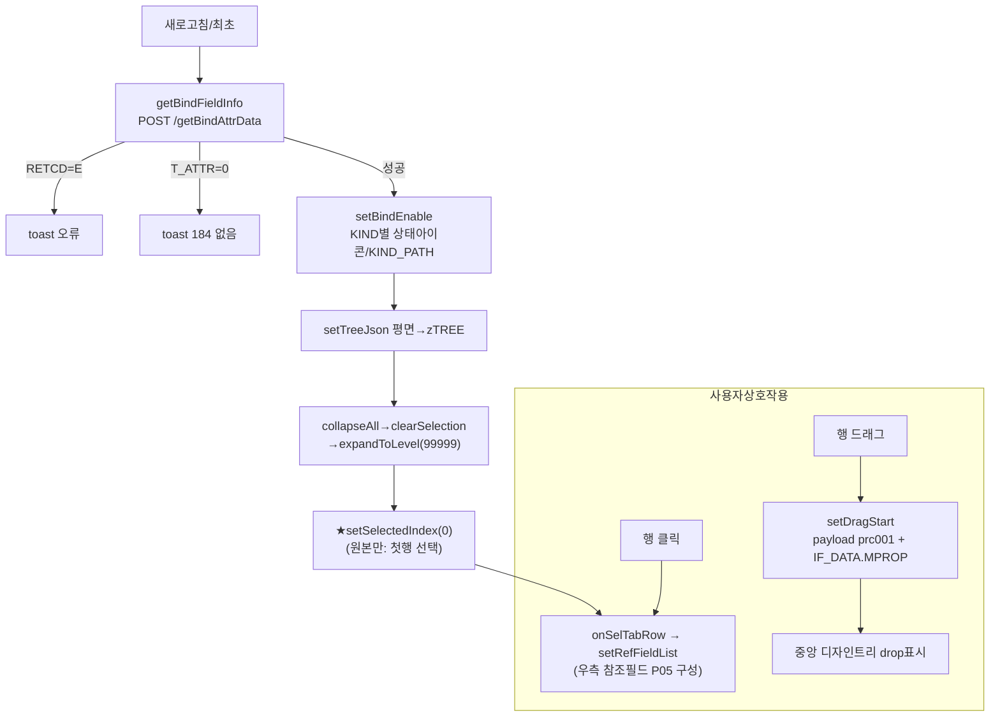
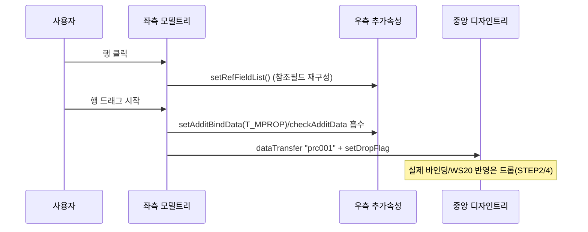

# STEP 1 — 좌측 "모델 필드" 영역 분석 (2026-07-24)

> SSOT = 원본 UI5 `index.js`(8730줄). HTML5 현행 = `modelFieldArea/modelFieldArea.js`.
> 이 문서는 **읽기·문서화만**. 코드 변경 없음. 모든 흐름에 `파일:라인` 근거.

---

## A. 화면 구성요소

좌측 = **모델 필드 트리**(바인딩 원본이 될 클래스/모델 필드 목록). 위에 툴바 1줄 + 아래 3열 트리.

| 요소 | 원본(UI5) | HTML5 현행 | 비고 |
|---|---|---|---|
| 컨트롤 | `sap.ui.table.TreeTable` selectionMode:Single, RowOnly (index.js:4334) | `U4AUI.makeColumnTree`(공통) (modelFieldArea.js:94) | 공통 다열 트리로 대체 |
| 컬럼1 | **174 Object Name** = `{NTEXT}` (index.js:4382) | label 174, width 16rem, 트리 이름칸(c1) (modelFieldArea.js:97/106) | |
| 컬럼2 | **175 Type** = 아이콘`{stat_src/stat_color}` + `{TYPE}` HBox (index.js:4402~4431) | label 175, 8rem. 셀 c2 = statIcon + TYPE (modelFieldArea.js:98/111~121) | |
| 컬럼3 | **176 Description** = `{DESCR}` (index.js:4437) | label 176, 16rem. 셀 c3 = DESCR (modelFieldArea.js:99/123) | |
| 툴바 | `oTool`(트리 extension, index.js:4342) | `#bwpModelTool` (modelFieldArea.js:47/53~91) | |
| 툴바 버튼 | 펼침/접힘·새로고침(강조)·**161 컬럼최적화**·168 분할초기화·957 커스터마이징·198 도움말 | 동일 라벨/아이콘 1:1 (modelFieldArea.js:54~88) | 좁아지면 ⋯오버플로(공통) |

- 데이터 노드 키(원본 1:1): `NTEXT`(이름)/`TYPE`/`DESCR`/`KIND`(T=테이블·S=구조체·E=필드)/`CHILD`(키)/`PARENT`/`ZLEVEL`/`zTREE`(자식).
- 상태아이콘 `stat_src` = 바인딩 가능표시(녹색 status-positive). 원본은 색 `stat_color:#01DF3A` 하드코딩(index.js:8235) — HTML5는 `H.statIcon`가 의미 클래스(status-positive)로 대체.

---

## B. 사용자 액션 → 결과 (화면 관점)

| 액션 | 원본 결과 | HTML5 결과 |
|---|---|---|
| 행 클릭(선택) | 그 행 선택강조 + **우측 참조필드(P05) 목록 재구성** (index.js:5498 onSelTabRow→5524 setRefFieldList) | 동일. onSelect→selectKey(강조)+setRefFieldList (modelFieldArea.js:133~140) |
| 행을 중앙으로 **드래그** | 편집모드에서만. 그 필드를 중앙 디자인트리에 드롭할 수 있게 payload 구성 + 중앙에 drop 가능표시 (index.js:8446 setDragStart) | 동일. `_wireModelDrag` dragstart (modelFieldArea.js:204~239) |
| 펼침/접힘 버튼 | 전체 펼침(expandToLevel 99999)/전체 접기 | tree.expandAll / collapseAll (modelFieldArea.js:54~61) |
| 새로고침 버튼(강조) | 모델필드 재조회(getBindFieldInfo) | loadBindData (modelFieldArea.js:63~65) |
| 161 컬럼최적화 | 각 컬럼을 콘텐츠폭으로 autofit (setUiTableAutoResizeColumn) | autofitTreeColumns(채움 없는 순수 autofit) (modelFieldArea.js:69~71) |

---

## C. 함수 흐름 (원본 `파일:라인`)

### C-1. 데이터 로드
```
새로고침/최초 → getBindFieldInfo (index.js:8046)
  → sendAjax(servNm+"/getBindAttrData", {CLSNM:CLSID, APPID}) (index.js:8069~8074)
  → 성공: TREE = param.T_ATTR (8096)
        · edit = (IS_EDIT==="X") (8102)
        · ZLEVEL===2 & KIND!==E 만 필터 → setBindEnable (8131~8134)  ← 상태아이콘 계산
        · setTreeJson(평면 TREE → 중첩 zTREE) (8137)
        · collapseAll → clearSelection → expandToLevel(99999) (8142~8148)
        · setSelectedIndex(0)  ← ★첫 행 선택 (8172)
        · setUiTableAutoResizeColumn (8175)
```
HTML5 대응: `loadBindData` (modelFieldArea.js:275) — 동일 서버·동일 파라미터. 차이는 §"원본 vs HTML5" 참조.

### C-2. 바인딩 가능여부(상태아이콘) — `setBindEnable` (index.js:8206)
KIND 재귀:
- **T(테이블)**: enable=true, 녹색아이콘, chkRangeTable, 하위로 재귀(KIND="T" 전파) (8231~8244)
- **S(구조체)**: enable=false(구조체 자체 드래그 불가), 아이콘 없음, 하위 재귀(부모 KIND 유지) (8246~8256)
- **E(필드)**: enable=true, 녹색아이콘 (8258~8265)

HTML5 대응: `_applyBindEnable`(modelFieldArea.js:158). **차이 1개**: 원본은 ZLEVEL===2 구조/테이블부터 진입하나, HTML5 좌측은 앱 루트가 최상위라 컨테이너(T/S/E 아님) default 케이스에서 `sKindPath=""`로 재귀 재시작(modelFieldArea.js:181~186, 장군님 지적 2026-07-14 반영).

### C-3. 행 선택 → 참조필드 연동
```
행 선택 → onSelTabRow (index.js:5498)
  → 선택해제(-1)면 이벤트 detach 후 재선택 (재진입 가드) (5504~5520)
  → setRefFieldList() (5524)  ← 우측 추가속성 P05 DDLB 재구성
getSelectedModelLine (index.js:5352): 선택 행의 노드 반환(없으면 undefined) — 참조필드가 공용
```
HTML5 대응: onSelect(modelFieldArea.js:133), getSelectedModelLine(modelFieldArea.js:41).

### C-4. 드래그 시작 — `setDragStart` (index.js:8446)
```
dragstart → payload l_obj 구성:
  PRCCD:"PRC001", RETCD/RTMSG/T_ERMSG, DnDRandKey(세션키) (8476~8488)
  IF_DATA = 드래그행 깊은복사 (8491)
  IF_DATA.MPROP = setAdditBindData(우측 T_MPROP) (8494)   ← 우측 스테이징값 캐리
  checkAdditData() 오류면 RETCD=E 실어보냄 (8497~8504)
  dataTransfer.setData("prc001", json) (8510)
  → 중앙 디자인트리 drop 표시 초기화+설정(resetDropFlag/setDropFlag/setDropStyle) (8514~8530)
  → 드래그행 setSelectedIndex (8544)
```
HTML5 대응: `_wireModelDrag`(modelFieldArea.js:204). payload 동일 계약. **차이**: 원본은 IF_DATA에 자식(zTREE) 포함 → HTML5는 payload 경량화 위해 zTREE 제외(`_dragField`, modelFieldArea.js:199~203). 드롭측은 필드 자체 속성만 소비.

---

## D. 데이터

| 이름 | 의미 | 출처 |
|---|---|---|
| `T_ATTR` | 서버가 준 **평면** 모델필드 배열 | /getBindAttrData 응답 (index.js:8096) |
| `zTREE` | 평면→중첩 트리(자식 배열) | setTreeJson/ setTreeData (index.js:8137 / modelFieldArea.js:322) |
| `KIND` | T=테이블 / S=구조체 / E=필드 (RTTI 분류) | setBindEnable 분기 기준 |
| `KIND_PATH` | 루트→현재까지 KIND 경로(드롭측 checkValidBind 검증용) | setBindEnable 누적 |
| `stat_src` | 바인딩 가능 상태아이콘(녹색) | setBindEnable |
| `CHILD`/`PARENT` | 노드키/부모키(트리 구성) | 서버 |
| `MPROP` | 드래그 시 우측 추가속성 스테이징값을 pipe로 실어 캐리 | setAdditBindData (§C-4) |

- 서버 호출: `POST {servNm}/getBindAttrData` — body `CLSNM`(=CLSID), `APPID`. 응답 `RETCD`/`RTMSG`/`T_ATTR`.
- 편집 가능: `oAppInfo.IS_EDIT === "X"` → editable. 편집 아니면 드래그 소스 비활성(draggable=false).

---

## E. 영역 간 신호

| 방향 | 신호 | 트리거 |
|---|---|---|
| 좌 → **우** | `setRefFieldList()` 직접호출 (참조필드 P05 재구성) | 행 선택(onSelTabRow / onSelect) |
| 좌 → **중앙** | 드래그 payload `prc001`(PRCCD:PRC001) + `designSetDropFlag`(drop 가능표시) | dragstart |
| 좌 ← 우(간접) | 드래그 시 우측 스테이징 `T_MPROP`/`checkAdditData`를 payload에 흡수 | dragstart (§C-4) |
| 좌 → WS20 | **없음(직접)**. 좌측은 WS20에 직접 방송 안 함. WS20行은 중앙 드롭이 트리거(STEP 4에서 분석) | — |

> ★ 좌측은 **WS20에 직접 방송하지 않는다.** WS20으로 가는 실제 트리거(드롭/버튼)는 STEP 2·4에서 확정.

---

## F. 다이어그램





---

## ★ 원본 vs HTML5 차이 (이번 단계는 보고만 — 코드수정 없음)

| # | 항목 | 원본(index.js) | HTML5(modelFieldArea.js) | 판단 |
|---|---|---|---|---|
| Δ1 | **최초 로드 첫행 선택** | `clearSelection`(8145) **후** `setSelectedIndex(0)`(8172) → 첫 행 선택 → onSelTabRow → **setRefFieldList 즉시 실행** | ~~`rerender(false)`~~ → **✅ 수정: `rerender(true)`+`setRefFieldList` 명시 호출 복원**(modelFieldArea.js:326~) | ✅ **처리완료(2026-07-24)** — C-3 확인대기. refreshModelTree(재조회) 경로는 rerender(false) 유지(회귀 없음). |
| Δ2 | 드래그 시작 행 선택 | `setSelectedIndex(_indx)`(8544) = 드래그한 행 선택강조 | dragstart에서 selectKey 호출 없음(modelFieldArea.js:212~239) | ⚠ 경미. 드래그로 시작해도 좌측 선택표시 안 바뀜. |
| Δ3 | IF_DATA 자식(zTREE) | 깊은복사에 zTREE 포함(8491) | zTREE 제외 경량화(199~203) | ✔ 의도적(드롭측 미소비). 문제 아님. |
| Δ4 | 상태아이콘 색 | `stat_color:"#01DF3A"` 하드코딩(8235/8262) | 의미 클래스(status-positive)로 대체(H.statIcon) | ✔ 하드코딩 hex 금지 규칙 준수. |
| Δ5 | setBindEnable 진입점 | ZLEVEL===2 T/S부터(8131) | 앱루트 최상위라 컨테이너 default서 KIND_PATH 재시작(181~186) | ✔ 장군님 지적(2026-07-14) 반영. |

> **보고**: Δ1이 실동작에 영향 가능(초기 우측 참조필드 목록이 빈 채로 뜸). 원본은 로드 직후 첫 행을 선택해 참조필드를 구성한다. 되살릴지 여부는 장군님 지시 대기.
