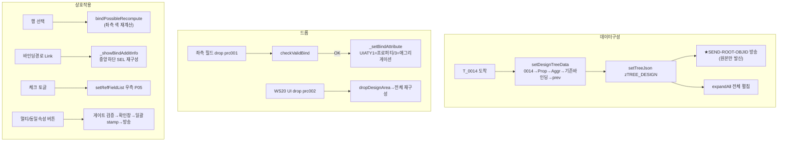

# STEP 2 — 가운데 "디자인 트리" 영역 분석 (2026-07-24)

> SSOT = 원본 UI5 `uiModule/designTree.js`(4217줄). HTML5 현행 = `designArea/designArea.js`(1073줄).
> 읽기·문서화만. 코드 변경 없음. 모든 흐름에 `파일:라인` 근거.

---

## A. 화면 구성요소

가운데 = **디자인 트리**(현재 앱의 UI 계층 + 각 UI 의 Property/Aggregation 자식 + 기존 바인딩 표시).
좌측 필드를 여기에 **드롭**해 바인딩하고, 행을 체크해 **일괄(멀티/동일속성)** 처리한다.

| 요소 | 원본(designTree.js) | HTML5(designArea.js) | 비고 |
|---|---|---|---|
| 컨트롤 | `sap.ui.table.TreeTable` (numberOfExpandedLevels:3, collapseRecursive) (4148~4157) | `U4AUI.makeColumnTree` (956) | 공통 트리 |
| 컬럼1 | **A50 Object Name**(50%): 체크박스+이미지+아이콘+`{DESCR}`+`{SUBTX}` **+ `ObjectStatus{EMATT/EMATT_ICON}`** (4036~4100) | 174, 18rem: slotLead(체크박스)+icon(_nodeIcon)+label(DESCR+SUBTX) (947/971/985) | ⚠ **EMATT 배지 미렌더**(§차이 ΔC1) |
| 컬럼2 | **165 바인딩 경로**: `Link{UIATV}` press onShowBindAdditInfo (4101~4129) | 165, 14rem(잔여흡수). Link → onShowBindAdditInfo (948/986~996) | ✔ |
| 컬럼3 | **MPROP** `visible:!oAPP.APP.isPackaged` (개발 전용) (4132~4145) | bDevCol 게이트, 10rem (945/950/999) | ✔ isPackaged 게이트 1:1(검증완료) |
| 행 액션 | `RowAction` visible{/edit}, 2슬롯: accept=onAdditionalBind{_bind_visible} / disconnected=onUnbind{_unbind_visible} (4161~4177) | 마지막 컬럼 4.5rem, iconBtn 2슬롯 동일 (889~901/1004) | ✔ 우측 고정(sticky) |
| 행 하이라이트 | `RowSettings highlight:{_highlight}` (4158) | rowHook H.rowHl(_highlight) (1007~1009) | ✔ |
| 드롭 | `DropInfo drop:onDropBindField, dragEnter:onDragEnter` (4178~4185) | native drop/dragover 배선(_wireDesignDrop) (768~816) | ✔ |
| 툴바 | 펼침/접힘·선택해제(187)·**동일속성(129)·멀티바인딩(130)·Unbind(186)**·컬럼최적화(161)·커스터마이징(957)·도움말(198) | 동일 1:1 (908~939) | 3버튼 색=Accept/Emphasized/Reject |

- 노드 유형 `DATYP`: **01=UI 오브젝트**(T_0014) / **02=Attribute**(T_0015) / **03=그룹표현**(Properties/Aggregations 헤더).
- 체크박스는 `_check_visible`인 속성/애그리게이션 행에만(멀티 선택 대상).

---

## B. 사용자 액션 → 결과 (화면 관점)

| 액션 | 결과 |
|---|---|
| **좌측 필드를 행에 드롭**(prc001) | 그 행이 drop 가능하면 바인딩 → 바인딩경로(UIATV) 채워짐 (onDropBindField / _onDesignDrop) |
| **WS20 캔버스 UI를 트리에 드롭**(prc002) | 디자인 트리 **전체 재구성**(dropDesignArea → setDesignTreeData) |
| **행 선택(클릭)** | 좌측 모델필드 **바인딩 가능/불가 재계산**(이미 바인딩=파랑) — bindPossibleRecompute (1017~1022) |
| **바인딩경로(Link) 클릭** | 중앙 하단(DESIGN_ADDIT) 패널을 그 필드로 재구성해 표시 — onShowBindAdditInfo (§3.5) |
| **체크박스 토글** | 멀티 대상에 포함 + 우측 참조필드(P05) 재구성(setRefFieldList) (977~981) |
| **행 액션 ✓(132)** | 그 행에 추가속성(MPROP) 적용 — onAdditionalBind |
| **행 액션 해제(186)** | 그 행 바인딩 해제 — onUnbind(확인창 185) |
| **툴바 130 멀티바인딩** | 체크행 전부를 좌측 선택필드로 바인딩(게이트→확인166/156→157) |
| **툴바 186 멀티해제** | 체크행 전부 해제(게이트→확인166/167→155) |
| **툴바 129 동일속성** | 1건 선택·바인딩됨·후보 있음 검증 후 **동일속성 화면 진입**(§5, STEP3/별화면) |
| **툴바 187 선택해제** | 전 체크 해제(_clearChecks) |

---

## C. 함수 흐름 (원본 `파일:라인`)

### C-1. 트리 데이터 구성 — `setDesignTreeData` (designTree.js:3322)
```
T_0014 순회:
  _setDesignTreeData0014 (UI 노드) → _setDesignTreeDataProp (Properties그룹+프로퍼티)
  → _setDesignTreeDataAggr (Aggregations그룹+애그리게이션) → _setBindAttrData (기존 T_0015 바인딩 매핑)
  → _setPrevData (미리보기/바인딩 캐시 prev[OBJID])
setTreeJson(평면→zTREE_DESIGN)
→ ★broadcast "SEND-ROOT-OBJID", _aTree[0].OBJID (3384)   ← 최상위 UI OBJID 를 WS20 에 통지
```
HTML5 대응: `setDesignTreeData`(designArea.js:845) — 4빌더 1:1. **차이 2건**: EMATT 배지 미렌더(ΔC1), SEND-ROOT-OBJID 미발신(ΔC2). §차이 참조.

### C-2. 드롭 — `onDropBindField` (원본) / `_onDesignDrop` (designArea.js:741)
```
drop:
  ① prc002(WS20 캔버스 UI) 있으면 → dropDesignArea → _chkDesignTreeDragData(100/103/104) → 전체 재구성. 종료.
  ② prc001(좌측 모델필드) → _checkDragData(DnDRandKey 일치+사전오류) → _dropNodeOf(행)
     → checkValidBind(불가 시 toast) → ★IF_DATA.MPROP="" (DESIGN TREE 드롭은 추가속성 미적용, §4.8-b)
     → _setBindAttribute(UIATY 1=프로퍼티 attrSetBindProp / 3=애그리게이션 attrBindCallBackAggr) → 재렌더
```
드롭존 표시: dragover 에서 prc002=전체 드롭존 / prc001=`_drop_enable` 행에만 테두리 (788~805).

### C-3. 행 선택 → 좌측 재계산 — `bindPossibleRecompute` (원본 bindPossible.js require)
```
행 선택 → onSelect(1017) → bindPossibleRecompute(n)
  → 좌측 모델필드 색 재계산(이미 바인딩=파랑, 가능=녹색 등)
```
원본: 각 핸들러가 `parent.require("./modelFieldArea/bindPossible.js")(_sTree)` (designTree.js:1588/1874/2244).

### C-4. 바인딩경로 링크 → 중앙 하단 — `_showBindAdditInfo` (designArea.js:288 / 원본 225)
```
Link 클릭 → onShowBindAdditInfo:
  게이트(UIATV 있음·UIATY=1·모델필드 존재·KIND=E) 통과 시
  → S_SEL_ATTR 전역화 → setAdditBindInfo(중앙 하단 SEL 스토어 재구성) → setAdditLayout(KIND)
  ★우측(MAIN 스테이징)은 절대 안 건드림
```

### C-5. 일괄 처리 (멀티/동일속성)
- **멀티 바인딩**: `onMultiBind`(494) → _checkMultiBinding 게이트(087/085/checkValidBind) → 확인(166/156) → attrSetBindProp 반복 → 157.
- **멀티 해제**: `onMultiUnbind`(541) → _checkMultiUnbinding(087/미바인딩147) → 확인 → attrSetUnbindProp 반복 → 155.
- **동일속성**: `onSynchronizionBind`(579) → 검증(183/107/108/109/158) → openSyncBindScreen(§5, 별화면·STEP3에서).

---

## D. 데이터

| 이름 | 의미 |
|---|---|
| `T_0014` | UI 오브젝트(계층) — WS20 방송(prc002/UPDATE)로 채움. 트리 UI 노드(DATYP 01) 원천 |
| `T_0015` | Attribute(프로퍼티/애그리게이션 바인딩값). ISBND="X"=기존 바인딩. UIATV=바인딩경로 |
| `T_0023` | UI 타입별 속성 카탈로그(프로퍼티/애그리게이션 목록 = _buildProp/_buildAggr 원천) |
| `T_0022` | UI 컨트롤 메타(아이콘 UICON 등) |
| `zTREE_DESIGN` | 평면→중첩 디자인 트리(SSOT) |
| `prev[OBJID]` | 미리보기/바인딩 캐시(_T_0015/_MODEL 등) — 바인딩 쓰기가 여기에 반영 |
| `S_14_*` | 트리 노드가 보존하는 T_0014 전 필드(WS20 재전송 시 역매핑, getDesignT0014) |
| `MPROP` | 그 행에 적용된 추가속성 직렬화값(개발 컬럼 표시). 드롭은 미적용, 버튼 적용만 stamp |
| `EMATT`/`EMATT_ICON` | 임베디드 속성 표시(색채움=0:1 / 차원=0:N). **원본은 이름칸에 배지로 렌더** |

---

## E. 영역 간 신호

| 방향 | 신호 | 트리거 | HTML5 상태 |
|---|---|---|---|
| 중앙 → **좌** | bindPossibleRecompute (좌측 색 재계산) | 행 선택·바인딩/해제 후 | ✔ 배선 |
| 중앙 → **중앙하단** | setAdditBindInfo(SEL 재구성) | 바인딩경로 Link 클릭 | ✔ |
| 중앙 → **우** | setRefFieldList(참조필드 P05) | 체크박스 토글 | ✔ |
| 중앙 → **WS20** | **SEND-ROOT-OBJID**(최상위 OBJID 통지) | setDesignTreeData 끝 | ⚠ **발신 미배선**(ΔC2, 수신 dispatcher case 는 존재:737) |
| 중앙 → **WS20** | designBroadcastUpdate / UPDATE-DESIGN-DATA(MPROP stamp 반영) | 추가속성 적용(139/132) | ✔ 배선(가드) — 상세 STEP4 |
| WS20 → **중앙** | prc002 드롭 → 전체 재구성 / DESIGN-TREE-SELECT-OBJID(행 선택) | WS20 캔버스 조작 | prc002 ✔ / SELECT-OBJID = STEP4 확정 |

---

## F. 다이어그램



---

## ★ 원본 vs HTML5 차이 (보고만 — 코드수정 없음)

| # | 항목 | 원본 | HTML5 | 판단 |
|---|---|---|---|---|
| ΔC1 | **임베디드 속성 배지(EMATT)** | 이름칸 우측에 `ObjectStatus{text:EMATT, icon:EMATT_ICON}` 렌더(designTree.js:4093~4097). 색채움=0:1, 차원=0:N | ✅ **수정: rowHook 에서 이름칸에 `.u4aBwpEmatt` 배지 덧댐**(designArea.js `_ematBadge`+rowHook, frame.css). 아이콘/색/크기 = **WS20 UI 트리(js/ws_html5_ws20_tree.js:193)와 완전 동일** 0:1 fa-regular fa-square / 0:N fa-regular fa-clone, --accent | ✅ **완료·통과(2026-07-24)** — 공통 미수정(스코프). WS20 UI 트리와 아이콘/색 통일. |
| ΔC2 | **SEND-ROOT-OBJID 발신** | `setDesignTreeData` 끝에서 최상위 UI OBJID 를 WS20 에 방송(designTree.js:3384) | HTML5 `setDesignTreeData`(845~875)에 **발신 없음**. 방송 dispatcher 에 수신 case(737)는 존재 | ⚠ **발신 미배선 — STEP4에서 확정.** WS20 이 팝업의 루트 UI 를 아는 경로. 다른 곳에서 보내는지 STEP4 영역간 분석 시 추적. |
| ΔC3 | 초기 펼침 레벨 | rows numberOfExpandedLevels:3 + 드롭/갱신 후 expandToLevel(99999) | setDesignTreeData 후 expandAll(전체) | ✔ 장군님 지시(2026-07-23 전체 펼침) 반영. 문제 아님. |
| ΔC4 | 초기 행 선택 | 디자인 트리는 **초기 선택 안 함**(모델트리와 달리 setSelectedIndex 없음) | rerender(false) = 선택 안 함 | ✔ 일치(Δ1 같은 이슈 없음). |
| ΔC5 | onDragEnter height 핸들 | TreeTable Auto 높이 0 회피용 height=auto 핵(designTree.js:1949) | DOM 기반이라 불필요 — dragover 로 drop 대상 분기(788~805) | ✔ 의도적(UI5 전용 핵 제거). 문제 아님. |

> **보고**: ΔC1(EMATT 배지)은 화면에 실제로 빠진 시각요소다. 데이터는 이미 계산돼 있어 이름칸에 배지만 추가하면 원본과 일치. 복원 여부 지시 대기.
> ΔC2(SEND-ROOT-OBJID)는 방송이라 STEP4에서 발신 경로 유무를 확정한 뒤 판단.
