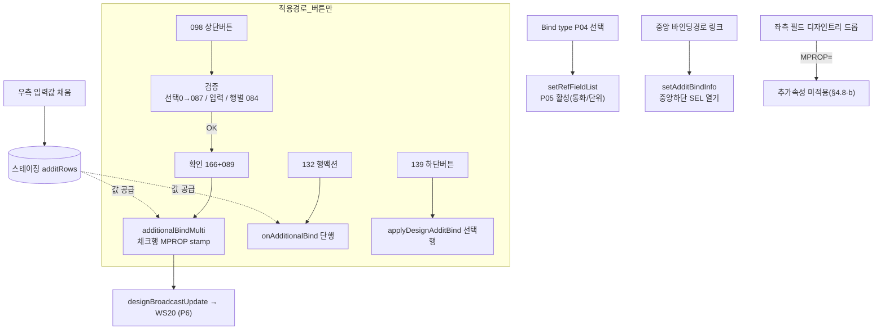

# STEP 3 — 우측 "추가 속성 바인딩" 영역 분석 (2026-07-24)  ★오해 지점

> SSOT = 원본 UI5 `uiModule/bindAdditInfo.js`(1306줄). HTML5 현행 = `additInfoArea/additInfoArea.js`.
> 읽기·문서화만. 코드 변경 없음. 모든 흐름에 `파일:라인` 근거.

---

## ★ 결론 먼저 — 이 영역은 "버튼으로 적용"이다 (드래그 아님)

우측 "추가 속성 바인딩"은 **값을 담아두는 스테이징(입력폼)**이다. 좌측 필드를 드래그해도, 옵션(Bind type 등)을
골라도 **그것만으로는 아무것도 적용되지 않는다.** 실제 적용은 **버튼**으로만 일어난다:

| 버튼 | 위치 | 무엇에 적용 | 원본 | HTML5 |
|---|---|---|---|---|
| **098 추가 속성 바인딩** | 우측(MAIN) 툴바 **상단** | 중앙 트리에서 **체크된 N행** 전부 | `onMultiAdditionalBind`(bindAdditInfo.js:162) | `additInfoArea.js:590` |
| **132 추가속성 적용** | 중앙 트리 **행 액션(✓)** | 그 **한 행** | `onAdditionalBind`(designTree.js) | `designArea.js:624` |
| **139 추가속성적용** | 중앙 **하단(SEL)** 툴바 | 링크로 연 그 **선택 행** | `onAdditBind`→`setMPROP` | `applyDesignAdditBind`(designArea.js:314) |

> ★ 드롭으로는 추가속성이 안 붙는다: 좌측 드래그 payload 는 MPROP 를 싣지만, 디자인 트리 드롭 처리에서
>   `IF_DATA.MPROP = ""` 로 **지운다**(designArea.js:759, §4.8-b). MPROP 전파는 위 3버튼(+동일속성 일괄적용)만.

---

## A. 화면 구성요소

우측 = **MAIN_ADDIT**(스테이징), 중앙 하단 = **DESIGN_ADDIT**(선택행 열람·수정). 두 패널은 **스토어 분리**.

| 요소 | 원본 | HTML5 |
|---|---|---|
| 우측 패널(MAIN) | TAB_NAME "MAIN_ADDIT"(bindAdditInfo.js:1126), 항상 표시, 초기 8행 | `oA.MAIN`(store `additRows`, host `bwpAdditInfo`) (additInfoArea.js:31) |
| 우측 툴바 | OverflowToolbar: **098 버튼**(1133)+스페이서+Help(1165) | 098 버튼+161 컬럼최적화+957+198 (additInfoArea.js:94~118) |
| 중앙하단 패널(SEL) | index.js BULK 레이아웃(6052) | `oA.SEL`(store `additRowsSel`, host `bwpAdditApply`) (additInfoArea.js:32) |
| 중앙하단 툴바 | 139 적용 + 선택 attribute 상태(ObjectStatus) | 139 `applyDesignAdditBind`+상태칩 (additInfoArea.js:138~153) |
| 입력 행 | UA028 속성들(P01~P08): Bind type(P04)/Reference Field(P05)/Conversion Routine(P06)/Nozero/Is number format 등 | 동일. 콤보/입력/스위치 = 공통 `createField` |

---

## B. 사용자 액션 → 결과

| 액션 | 결과 |
|---|---|
| 우측 입력값 채우기(Bind type 등) | **스테이징에만 쌓임**(additRows). 아직 미적용 |
| **우측 098 버튼 클릭** | 검증 통과 시 스테이징값을 **중앙 체크행 전부에 일괄 stamp**(MPROP) |
| Bind type(P04) 선택 | Reference Field(P05) 콤보가 **활성화**(setRefFieldList로 통화/단위 후보 채움) |
| Conversion Routine(P06) 입력 | 대문자 자동변환 + 확정 시 검증(존재하는 루틴인지) |
| 중앙 바인딩경로 **링크 클릭** | 중앙하단(SEL) 패널이 그 행 정보로 열림(setAdditBindInfo) |
| 중앙하단 139 버튼 | 그 선택 행에 SEL 스테이징값 적용(applyDesignAdditBind) |
| 중앙 행액션 132(✓) | 그 한 행에 MAIN 스테이징값 적용(onAdditionalBind) |

---

## C. 함수 흐름 (원본 `파일:라인`)

### C-1. 상단 098 일괄적용 — `onMultiAdditionalBind` (bindAdditInfo.js:162 / HTML5 additInfoArea.js:590)
```
① busy WS20 ON (원본:170) ─ HTML5는 P6(방송)에서 [★차이 ΔE1]
② 검증 checkMultiAdditBind (원본:189 / HTML5 인라인):
    - 디자인 트리 선택 0건 → 087+142(ACT02) 차단  ← ★선택 검증이 먼저(장군님 2026-07-16)
    - MAIN 입력 완결성 chkAdditBindData → 오류 목록
    - 행별 chkPossibleAdditBind → 실패행 _bind_error 마크 + 084 전체 차단
③ 확인창 166(건수)+089
④ _MPROP = setAdditBindData(T_MPROP) ─ 스테이징 직렬화(pipe, ITMCD 정렬, isFieldInfo=false)
⑤ additionalBindMulti(_MPROP) ─ 체크행 전부 MPROP stamp + _T_0015 갱신 (designArea.js:651)
⑥ toast 090 / busy는 WS20 왕복 후 해제(자기해제 금지)
```

### C-2. 참조필드(P05) 연동 — `setRefFieldList` (bindAdditInfo.js:706 / HTML5 additInfoArea.js:463)
```
모델필드 선택 or 중앙 체크 변경 → setRefFieldList:
  중앙 체크행 UIATV → 필드 추출 / 모델필드 PARENT 추가 → 1개 초과면 clearRefField
  → 소스필드 zTREE 에서 DATATYPE CUKY/UNIT 만 → P05 콤보 T_DDLB 구성
```
★ N5 클로저 버그(이미 수정): `bDdlbSync` 루프 단일변수 → P04 골라도 P05 안 열림. row.ITMCD 직접판정으로 수정.

### C-3. Conversion Routine(P06) — `convChangeInput`/`clearConvError` (bindAdditInfo.js:386/361 / HTML5 additInfoArea.js:397~)
```
입력(대문자, createField upper) → 확정 change → checkConversion(서버 존재확인) → 오류면 stat=Error+statTxt
★ R1(완료): 검증 메시지 = top-layer 팝오버(_bwpVsShow), 값 지우면 _bwpVsHide
```

### C-4. 스테이징 구성 — `setAdditialListData` (bindAdditInfo.js:870 / HTML5 additInfoArea.js:177)
초기 8행 기본형(UA028 items). 드롭/재구성 시 재호출.

---

## D. 데이터

| 이름 | 의미 |
|---|---|
| `additRows`(MAIN) / `additRowsSel`(SEL) | 두 패널 스테이징 행. **분리 스토어**(암묵 전역참조 금지) |
| `T_MPROP` | 행 배열 형태. `setAdditBindData`가 pipe 문자열 `MPROP` 로 직렬화 |
| `MPROP` | `P01|P02|…` pipe 문자열. 조회속성(FLD02=X) 제외 + ITMCD 정렬로 UA028 목록과 인덱스 짝 |
| UA028 P-codes | P04=Bind type / P05=Reference Field / P06=Conversion Routine / Nozero / Is number format … |
| `S_SEL_ATTR` | 중앙 링크로 연 선택 attribute(SEL 패널 대상) |

---

## E. 영역 간 신호

| 방향 | 신호 | 트리거 |
|---|---|---|
| 우 → **중앙** | `additionalBindMulti`(체크행 MPROP stamp) | 098 버튼 |
| 우 → **중앙** | `onAdditionalBind`/`applyDesignAdditBind`(단행 stamp) | 132 / 139 버튼 |
| 중앙 → **우** | `setRefFieldList`(P05 재구성) / `setAdditBindInfo`(SEL 재구성) | 체크 토글 / 링크 클릭 |
| 좌 → **우** | 드래그 시 우측 스테이징 흡수(payload MPROP), 모델필드 선택 시 P05 | 좌측 dragstart / 행 선택 |
| 우 → **WS20** | `designBroadcastUpdate`(MPROP 반영) + busy 왕복 | 적용 버튼 → P6(STEP4) |

---

## F. 다이어그램



---

## ★ 원본 vs HTML5 차이 (보고만)

| # | 항목 | 원본 | HTML5 | 판단 |
|---|---|---|---|---|
| ΔE1 | 098 적용 시 **busy WS20** | `setBusyWS20Interaction(true)` 로 시작, WS20 BUSY_OFF 왕복까지 유지(bindAdditInfo.js:170/228/244) | `onMultiAdditionalBind`(590)에 **busy 호출 없음**. 주석 "busy 왕복=P6". stamp 후 `additionalBindMulti`→`designBroadcastUpdate` | ⚠ **STEP4에서 확정.** 방송 P6 경로에 busy on/off 짝이 실제 배선됐는지 확인 필요(자기해제 금지 계약). |
| ΔE2 | 검증 로직 위치 | 별도 모듈 `checkMultiAdditBind.js` | `onMultiAdditionalBind` 인라인(590~630) | ✔ 로직 1:1(선택→입력→행별, 087/084/143). 구조만 다름. |
| ΔE3 | 패널 스토어 | UI5 모델(oModel.oData.T_MPROP) | additRows/additRowsSel **분리** | ✔ 원본 2패널 의미 유지(스토어 분리로 섞임 방지). |
| ΔE4 | R1/N5 개선 | (원본 UI5 거동) | 검증 팝오버 top-layer(R1), P05 클로저버그 수정(N5) | ✔ 완료·통과. |

> **보고**: ΔE1(098 적용 busy) 만 STEP4 방송 분석에서 확정. 나머지는 원본과 일치. 이 영역의 "버튼으로 적용" 구조는 HTML5도 원본대로 정확히 배선돼 있음(098/132/139 모두 정의·배선 확인).
