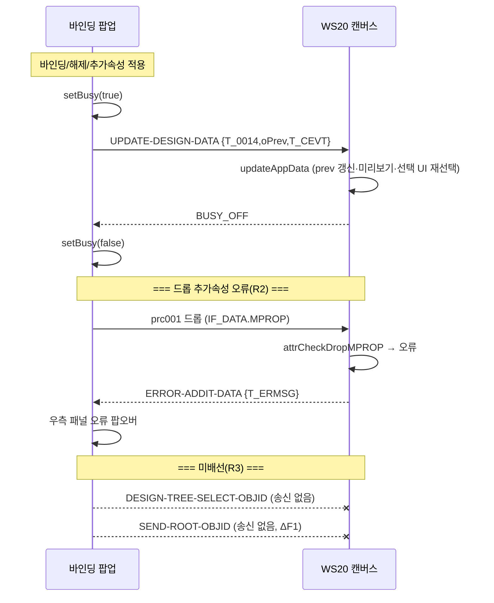

# STEP 4 — 영역 간 & WS20 처리 흐름 분석 (2026-07-24)

> SSOT = 원본 UI5 + 방송 양측. HTML5 팝업측 = `wsDesignHandler/bindBroadcast.js`,
> WS20측 = `design/bindPopupHandler/broadcastChannelBindPopup.js`(사실상 데이터 로직, sap 4건),
> WS20 드롭검사 = `design/js/uiAttributeArea.js`. 읽기·문서화만.

---

## A. 방송 채널 개요

팝업 ↔ WS20 은 `BroadcastChannel(channelKey)` 하나로 양방향 통신. **PRCCD 로 라우팅**.
★ 불변: **PRCCD 철자 비대칭** — 송신 `UPDATE-DESIGN-DATA`(하이픈) / 수신 `UPDATE_DESIGN_DATA`(밑줄). 통일 금지.

### 메시지 전수표 (방향 / 배선 상태)

| PRCCD | 방향 | 하는 일 | HTML5 배선 |
|---|---|---|---|
| `UPDATE-DESIGN-DATA` | 팝업 → WS20 | 팝업 변경(T_0014/oPrev/T_CEVT)을 WS20 캔버스에 반영 | ✅ 송신 `updateBindPopupDesignData` / WS20 수신 `updateAppData` |
| `UPDATE_DESIGN_DATA` | WS20 → 팝업 | WS20 변경을 팝업 트리에 반영(재빌드) | ✅ WS20 송신 `updateBindPopupDesignData(895)` / 팝업 수신 `_updateDesignData` |
| `BUSY_ON`/`BUSY_OFF` | 양방향 | busy 잠금/해제(왕복 계약) | ✅ 양측 |
| `ERROR-ADDIT-DATA` | WS20 → 팝업 | 드롭 추가속성 검사 오류 반송 | ✅ WS20 송신 `sendAdditError` / 팝업 수신 `_responseAdditError`(R2) |
| `U4A_HELP_DOC_OPEN` | 팝업 → WS20 | 도움말 문서 열기 위임(sParam 오타 "opstion" 유지) | ✅ 양측 |
| `ROOT_OBJID` (송신키 `SEND-ROOT-OBJID`) | 팝업 → WS20 | 팝업 최상위 UI OBJID 통지 → WS20 `DESIGN_ROOT_OBJID` 갱신 | ⚠ **팝업 송신 미배선**(ΔF1) / WS20 수신 `updateRootObjectID` 존재 |
| `DESIGN-TREE-SELECT-OBJID` | 양방향 | 트리↔캔버스 선택 동기화 | ❌ **양측 미배선**(R3) |

---

## B. 핵심 흐름

### B-1. 팝업에서 바인딩/추가속성 적용 → WS20 반영 (왕복 + busy)
```
팝업: attrChange(바인딩/해제) 또는 MPROP stamp(098/132/139)
  → designBroadcastUpdate (rAF 1회 합침)
  → updateBindPopupDesignData: ★setBusy(true) + post "UPDATE-DESIGN-DATA"{T_0014, oPrev, T_CEVT}
WS20: updateAppData
  → prev[key]._T_0015/_MODEL/_BIND_AGGR 갱신 + previewUIsetProp
  → 현재 선택 UI 포함 시 fnWs20DesignTreeItemPress (★HTML5명, 옛 designTreeItemPress 크래시 수정됨)
  → sendBindPopupBusyOff() + parent.setBusy("")
팝업: BUSY_OFF 수신 → setBusy(false)   ← ★자기해제 아님(WS20이 풀어줌)
```
→ **ΔE1(STEP3 이월) 해소**: 098 적용 busy 는 `updateBindPopupDesignData`가 setBusy(true)로 켜고 WS20 왕복(BUSY_OFF)으로 해제. 계약 준수 = **결함 아님**. (원본은 확인창 전부터 busy, HTML5는 stamp 시점부터 — 그 사이 검증/확인은 로컬·동기라 무해.)

### B-2. WS20 자체 변경 → 팝업 반영
```
WS20: updateBindPopupDesignData(895) → post "UPDATE_DESIGN_DATA"(밑줄)
팝업: _updateDesignData → T_0014/0015/CEVT 갱신 → setDesignTreeData(트리 재빌드) → _sendDesignAreaBusyOff → setBusy(false)
```

### B-3. ★R2/C-2 — 드롭 추가속성 오류 반송 (트리거 확정)
```
사용자: 팝업 좌측 필드를 ★WS20 캔버스★ 에 드롭 (payload prc001, IF_DATA.MPROP=스테이징값 실림)
WS20 uiAttributeArea.js 드롭수신:
  DnDRandKey 확인(불일치=214) → attrCheckDropMPROP(IF_DATA) (8533)
  오류면(예: P타입 아닌 필드에 Bind type P04 → msg 093):
    require(channel)("ERROR-ADDIT-DATA", T_ERMSG) (8547)  [+ 팝업 사전오류 T_ERMSG 병합]
  또는 payload 가 이미 RETCD=E+T_ERMSG(팝업 checkAdditData 사전검증):
    require(channel)("ERROR-ADDIT-DATA", l_json.T_ERMSG) (8563)
팝업: _responseAdditError → newBindError(ACT05, LINE_KEY=ITMCD) → 우측 패널 앵커 팝오버
```
★ **재현 전제**: 이 오류는 **드롭이 MPROP 를 실어 WS20 에 갈 때만**. 팝업 **자기 중앙 트리** 드롭은 MPROP 를 지우므로(designArea.js:759) 안 옴. → C-2 테스트 = **좌측 P타입 아닌 필드 + Bind type 설정 → WS20 캔버스에 드롭**.

---

## C. 데이터 흐름 (좌 → 중앙 → 우 → WS20)

```
좌(모델필드) ──선택──> 우(참조필드 P05 구성)
좌 ──드래그──> 중앙(디자인트리 드롭=바인딩, MPROP 미적용) 또는 WS20 캔버스(드롭=MPROP 검사)
우(스테이징) ──098/132/139 버튼──> 중앙(체크/선택행 MPROP stamp) ──방송──> WS20 반영
중앙(바인딩/해제) ──attrChange──> 방송 UPDATE-DESIGN-DATA ──> WS20 반영 ──> BUSY_OFF 왕복
WS20(자체변경/드롭검사) ──> UPDATE_DESIGN_DATA / ERROR-ADDIT-DATA ──> 팝업 반영/오류표시
```

---

## D. 다이어그램



---

## E. 미배선 / 차이 (STEP 4 확정 = R3 범위)

| # | 항목 | 원본 | HTML5 | 귀속 |
|---|---|---|---|---|
| ΔF1 | **SEND-ROOT-OBJID 송신** | `setDesignTreeData` 끝 팝업이 최상위 OBJID 통지(designTree.js:3384) → WS20 `DESIGN_ROOT_OBJID` 갱신 | ✅ **R3서 배선**: setDesignTreeData → `sendRootObjid(aTree[0].OBJID)`(ROOT_OBJID) | R3 완료 |
| ΔF2 | **DESIGN-TREE-SELECT-OBJID 양방향** | 팝업 트리 클릭→WS20 선택 / WS20 선택→팝업 트리 이동(양측 송·수신) | ✅ **R3서 배선**: onSelect 송신 + case 수신(selectDesignNodeByObjid). WS20측 송신(ws_html5_ws20_attr:2920)·수신 존재 | R3 완료 |
| — | UPDATE 왕복·busy·ERROR-ADDIT·HELP | (원본) | ✅ 배선 완료(R2 포함) | 완료 |
| — | ΔE1(098 busy) | busy WS20 왕복 | ✅ 계약 준수(결함 아님) | 해소 |

> **보고**: STEP4 로 미배선은 **R3(트리↔캔버스 선택 동기화) 하나로 수렴**. ΔF1(SEND-ROOT-OBJID)·ΔF2(DESIGN-TREE-SELECT-OBJID)가 그 내용물이다. `DESIGN_ROOT_OBJID` stale 이 WS20→팝업 드래그(prc002) 범위지정에 영향 주는지는 R3 착수 시 확인.
> **C-2(R2)**: 수신부는 완료. 트리거(좌측 P타입 아닌 필드+Bind type→WS20 드롭)를 위 B-3 로 확정 — 재시작 후 테스트 가능.
